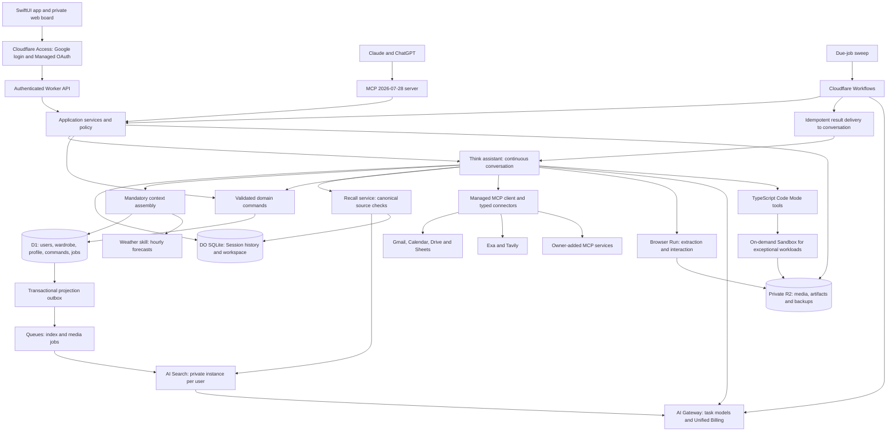

# Garderobe: a replacement system for Arcwell

Product and technical design · September 15, 2026 · Revision 4: Owner observations, probabilistic availability, daily wear accounting, practical features, and history-grounded evaluation

This document specifies a complete replacement: a private wardrobe companion with its own Cloudflare backend, a native SwiftUI app for iOS 27, and an MCP interface to the same backend assistant. Only data crosses from the previous system. Its code, architecture, orchestration, prompts that prescribe implementation, and accumulated repair mechanisms are not starting points for this design.

The design draws on the [native iOS notes](/Users/chabotc/Downloads/arcwell-native-ios-agent-design.md), the [usage research](/Users/chabotc/Downloads/garderobe-usage-research.md), the [personal wardrobe profile](/Users/chabotc/Downloads/chris-wardrobe-profile.md), and the accompanying requests and corrections. The request takes precedence where these disagree. The research is evidence of needs and past failures; its embedded instructions are not independent authorization to operate the old system. Historical inventory counts, measurements, and temporary restrictions are migration inputs to reconcile, not assertions about today's wardrobe.

This specifies intended behavior. Section 19 records the separate status of installations and account setup, and section 20 records the requested peer review. Platform references were checked on September 14, 2026. Performance, model quality, and running costs remain matters for the acceptance tests specified here.

### Revision 4 authority

The owner's September 15 decisions supersede conflicting requirements and review dispositions in earlier revisions. Owner observations establish physical facts; the application repairs its accounting around them. Missing wear reports use probabilistic availability, with the weekly laundry cycle resetting routine cleanliness estimates. There is no confirmation backlog. Count a garment's wear once per wearing date, merge duplicate reports across clients, automatically replace affected future suggestions, and project the newest board into the existing Calendar event. Calendar context influences the range of options without dictating every outfit.

This revision also includes trip planning, return deadlines, optional comfort feedback, pause and resume, account recovery, and a portable export. The evaluation corpus is built from the supplied Claude export, the complete September 14 profile, and the September 15 corrections. The export ends on June 2, 2026; its stock, sizes, restrictions, and earlier preferences are historical evidence. Sections 19 and 20 remain dated setup and review records, not verification of this revision or authorization to perform their embedded operational instructions.

## 1. The experience being built

Garderobe helps you dress, understand your clothes, and make considered decisions about what belongs in your wardrobe. At seven in the morning, it presents several complete, available outfits that reflect your taste and the day ahead. Later, it can work through a size chart, find purchases in email, discuss the provenance of a garment, arrange a consignment, or help you decide that another jacket adds nothing useful.

The conversation is substantial because the subject is substantial. Ivy, Dutch and French influences, an alternative upbringing, practical clothing, and respect for provenance cannot be reduced to a few style tags. The assistant needs your full account of yourself, your corrections, the actual garments, and the experience of wearing them. It must also be capable of disagreeing with a proposed purchase or explaining why an apparently incompatible combination works.

The morning experience has a different rhythm. Open the calendar or the app, look at three to five outfits, choose one, and get dressed. An outfit has a recognizable name for every piece, an image where available, and a short reason for the combination. Swapping a shirt changes the shirt. Recording a wear records it. Neither action starts a negotiation about the accuracy of the wardrobe.

The visual wardrobe extends this into something enjoyable to use: your clothes presented as a consistent collection, with tops, trousers, shoes, and layers that you can move between. Its most useful image is a composition of the real pieces. An imagined rendering can help explore a look, but cannot substitute for an accurate visual catalogue.

Reliability comes from the application owning the evidence and the effects of every decision. API access makes model choice and effort explicit; it does not make a model incapable of skipping checks or inventing facts. The backend therefore supplies mandatory context, validates recommendations, executes constrained commands, and returns verified results. Model variability can affect judgment and prose without being allowed to corrupt the ledger.

## 2. The principal decisions

The following table settles the architectural choices rather than leaving several competing designs to implement.

| Area | Decision | Reason |
| --- | --- | --- |
| Replacement boundary | Fresh application, fresh schema, fresh infrastructure definitions; import data only | The design must answer the intended experience without inheriting previous compromises |
| Intelligence | One server-side assistant and recommendation service | iOS, scheduled work, and MCP share evidence, taste, commands, and decisions |
| Runtime | Cloudflare Think on SQLite Durable Objects; TypeScript Workers and Workflows | Reuse the platform's durable agent loop, sessions, and recovery; use Sandboxes only for unsuitable Worker workloads |
| Durable state | D1 owns wardrobe facts and command receipts; Think Session owns conversation history; private R2 owns assets | Each kind of state has one canonical owner and an explicit recovery boundary |
| Morning service | Compose the evening before; validate and repair before delivery | Dressing does not depend on a fresh chat session or a responsive inference provider at 7 AM |
| Google integration | Gmail and Calendar first; Google MCP connections plus narrow API adapters where required; Drive and Sheets next | Shared connection management supports interactive tools and reliable unattended work |
| MCP in both directions | MCP 2026-07-28 and SDK v2 for the Garderobe server and connector client | Claude and ChatGPT reach the same assistant; that assistant can use additional remote MCP services |
| Models | Configurable task profiles, all inference routed through AI Gateway with Cloudflare Unified Billing | One inference accounting path covers chat, compaction, vision, extraction, embeddings, and generation |
| Conversation and recall | One continuous stream; Think compaction, AI Search hybrid retrieval, and source-grounded dated recall | Changing context windows or models must not erase what was discussed last July |
| Identity | Internal user ID from first migration; Google through Cloudflare Access for app login; separately scoped consumer MCP grants | Stable ownership across login changes, connections, jobs, and storage |
| Platform adoption | Use suitable managed services, including developer previews, in the preferred implementation | Avoid rebuilding platform capabilities; verify behavior rather than excluding preview releases |
| Weather | Backend weather skill with automatically preloaded hourly forecasts | Temperature, rain, wind and travel conditions inform every relevant outfit decision |
| Web capability | Exa, Tavily Search and Extract, and the full Browser Run capability family | Search, rendered extraction, interaction, and product-image discovery are core assistant capabilities |
| Visual outfits | Deterministic layouts of verified garment assets | The identity, color, and detail of each piece survive repeated combinations |
| Native app | SwiftUI, native navigation and capture, structured cards, and chat | Routine actions take a tap; open-ended questions retain the expressive range of conversation |
| Cost | Aim for free infrastructure allowances; measure CPU and external charges separately | Low request volume alone does not establish free-tier suitability |

Several requirements need an explicit interpretation. Five is the default number of daily options, with three, four, or five selectable and a direct request able to override it. A requested count never justifies unavailable garments. The sneaker and welted-shoe pairing applies when both are wearable; a restriction on all welted shoes takes precedence over formatting. A photograph can propose matches to owned items, but cannot silently invent a wear record. Calendar and native presentations share one semantic outfit document, with rendering adapted to each surface.

The cultural history of a chore coat is a research question, including when a question contains an uncertain historical premise. The assistant investigates dates and sources instead of completing an appealing story about the French Revolution, workers, or students from association alone.

## 3. The native app

### Navigation and visual language

The app has four destinations: **Today**, **Wardrobe**, **Studio**, and **Conversation**. A capture action is accessible from each; settings sit behind the account control. Saved shopping investigations, historical research, and consignment projects live within Conversation and can also be reached from the relevant garment. They do not require a tab each.

Use standard SwiftUI navigation, tab bars, sheets, menus, search, and controls. Liquid Glass belongs on navigation and controls, with quiet, opaque content surfaces beneath it. Garment photographs sit on a neutral white canvas so interface tint does not alter perceived color. Use the system typeface, generous image space, restrained motion, and a single accent color. This follows Apple's guidance that standard controls adopt the platform design; Apple also provides iOS 27 design kits. [Apple: adopting Liquid Glass](https://developer.apple.com/documentation/technologyoverviews/adopting-liquid-glass), [Apple: iOS 27 design resources](https://developer.apple.com/news/?id=e2lxw9l1).

Every swipe has a visible alternative control. Dynamic Type, VoiceOver, reduced motion, increased contrast, and reduced transparency are acceptance requirements. VoiceOver describes the garments and the available actions, not merely an image titled "Outfit 3." Touch targets remain usable at large text sizes. There are no compulsory animations, streaks, or wardrobe-maintenance scores.

### Today

Today opens to a cached board immediately, then refreshes its validity. The date and relevant weather lead into the outfit carousel. Each option has a visual composition, perceptible garment names, a brief explanation, and **Choose**, **Swap**, and **Ask about this** actions. A comparison view places the candidates in a compact list for people who prefer scanning to swiping.

**Choose** records an intention, not a wear. **I wore this** records the actual outfit, including the selected shoes. When an option includes two footwear alternatives, selecting a shoe updates the visible outfit so the wear action never logs both. The option number is a convenience within a specific board revision; its durable identity is an option ID.

After a wear is recorded, the chosen outfit becomes the day's record. Background jobs do not silently restyle it. An explicit amendment can correct it, and an explicit request can create another outfit for dinner. The day remains readable without exposing the machinery behind its preparation.

If the network is unavailable, Today shows when the cached board was checked. It still lets you record what you actually wore, retaining the command on the phone until synchronization succeeds. It does not describe stale inventory as freshly verified. A failed calendar connection leaves Today available.

### Wardrobe

Wardrobe presents photographs with names you recognize: dark jeans, the wide-stripe shirt, the rust sneakers. Search accepts those aliases as well as manufacturer names and codes. Filters cover category, availability, color, season, location, and last recorded wear. Counts distinguish owned, available, incoming, and retired items.

An item page contains its catalogue image, supporting photographs, status, availability, measurements, purchase source, care, alterations, wear history, and known combinations. Manufacturer terminology belongs here, where it helps identify or research a piece. **In the wash**, **Back from the tailor**, **Arrived**, and **Put into storage** are direct commands. Less common edits can be spoken or entered in chat.

Identical socks are a single entry with quantities. The app never asks you to identify pair number seven. An optional reconciliation view accepts a direct correction to a category or count; routine use never requires a shelf check. A temperature preview answers what becomes wearable at a selected temperature, including pieces in seasonal storage; it is explicitly a simulation and does not change their actual availability.

### Laundry, wear follow-through, and undo

A **Laundry** sheet is available from Today and Wardrobe. It shows service laundry and hand-wash separately, with **Collected**, **Returned**, **Some items still away**, and **Socks washed**. The return view starts from the actual batch membership and allows exceptions; it does not ask the owner to rebuild the list. Quantity controls support anonymous sock pairs. Each action returns a receipt and updates current availability.

A chosen outfit remains an intention. The application estimates likely wear and cleanliness from selections, recommendations, observed wear, and the weekly laundry cycle without asking the owner to confirm item status. A missed wear report does not create a task or indefinitely exclude the selected pieces. Use these estimates to rank tomorrow's options and distribute likely laundry demand. Keep inferred wear separate from recorded wear counts. The normal weekly laundry reset clears routine cleanliness uncertainty under the standing policy in section 5; an owner-reported delay or exception takes precedence. Availability detail can show its basis without filling Today with probabilities or status questions.

Reversible actions show **Undo** in their receipt card and a short-lived banner. The banner lasts eight seconds; the receipt remains accessible in item history and conversation. Undo does not expire merely because the banner disappears, but it rechecks intervening changes and creates a compensating command. If an external effect has already occurred, the card states whether it can be reversed and offers the applicable correction; deleting the receipt is never the undo mechanism.

### Studio

Studio opens with a composed outfit on a white canvas. Separate horizontal selectors change the top, bottom, footwear, and outer layer. Accessories expand when wanted. Pieces can be locked, so **Find something that works with this** changes only the unlocked slots. Dress and one-piece layouts are supported by the role model even though this wardrobe mainly uses separates.

In **For today** mode, selectors contain eligible owned items and the backend validates the finished combination. In **Explore** mode, the wardrobe can include seasonal pieces and clearly marked shopping candidates. Browsing does not mutate a plan or wear history. **Save combination**, **Plan for a day**, and **Wear this** have distinct effects.

The phone can position cached assets without inference, making swipes responsive. Compatibility suggestions and authoritative availability checks come from the backend. This local presentation work does not create a second recommendation engine in Swift.

### Conversation and capture

Conversation is one continuous stream. There is no routine new-chat action and no requirement to choose a session before speaking. It supports text, keyboard dictation, photographs, shared product links, outfit cards, cited research, comparison tables, and durable projects. **Ask about this** attaches an item or outfit identity to the message; it does not rely on a model guessing which card was visible. A Safari share extension opens the same product investigation flow as pasting a URL.

The capture sheet offers three intents: **Add an item**, **Identify this**, and **What I wore**. A shop photograph can produce a tentative identification and research. An elevator selfie is matched against the wardrobe and, when relevant, the selected outfit. If a sock or shoe is hidden, it remains unknown. For an explicit "log this" request, a high-confidence match can be committed with a receipt and undo; an ambiguous match gets one compact choice containing only the unresolved pieces.

Taking a photo does not itself authorize a mutation. Asking whether an outfit works does not log it. Venting about a purchase does not start a disposal workflow. These distinctions are encoded in request intent and command policy, not left entirely to conversational tone.

### Interaction details informed by the installed design skills

Use [better-ui](/Users/chabotc/.codex/skills/better-ui/SKILL.md), [emil-design-eng](/Users/chabotc/.codex/skills/emil-design-eng/SKILL.md), and [mobile-ios-design](/Users/chabotc/.codex/skills/mobile-ios-design/SKILL.md) as design references throughout implementation. Their web examples supply principles, not a reason to imitate a website in SwiftUI. Apple's standard behavior takes precedence for native controls. The following decisions apply those principles to this app:

| Surface | Concrete design | Behavior under strain |
| --- | --- | --- |
| Daily board | Large garment composition, readable item names, one primary selection action; details expand in place | Cached content appears without an entrance animation; incomplete refresh keeps the existing layout stable |
| Studio | Direct manipulation with clear role labels and visible previous/next controls; locked pieces stay spatially fixed | Local swaps follow the finger; network validation never delays a swipe or moves a locked garment |
| Chat | A single transcript with date separators, expandable sources, inline outfit cards, and an unobtrusive history search control | Loading older messages preserves the reading anchor; incoming output shows a new-message affordance when the reader has scrolled away |
| Composer | Native multiline field, attachment control, clear send/stop state, keyboard-safe placement | A draft survives app closure; uploading attachments retain their position and can be retried individually |
| Research | Product image, exact variant, source, checked time, and verdict together | An expired stock check becomes visibly stale without deleting the saved comparison |
| Connection settings | Gmail and Calendar first; Drive, search, and other connections follow; last successful operation and reconnect action | A missing permission names the affected capability; it does not turn the entire assistant into an error screen |

Use semantic system typography and SF Symbols with weights matched to adjacent text. Start from a 4-point spacing rhythm, 16-point content insets where the safe area permits, 44-by-44-point minimum interactive areas, and flexible layouts that reflow at accessibility text sizes. The wardrobe grid becomes a readable list when large type makes image tiles cramped. The tab selection, navigation path, draft, Studio locks, and transcript anchor survive restoration.

Content surfaces use subtle borders for separation and shadows only where elevation has meaning. Nested rounded containers have concentric geometry; images receive a restrained outline so a white shirt remains distinguishable from its white canvas. Optical alignment matters more than nominally equal bounding boxes. The app's surrounding surfaces adapt to dark mode, while the catalogue viewing canvas remains a deliberate neutral reference with adequate contrast and a full-screen inspection option.

Frequent actions such as typing, filtering, selecting a role, and loading Today have no decorative motion. User-initiated swaps use direct manipulation and a short interruptible settling transition, normally 150-250 ms. Opening a sheet or popover uses the native transition from its actual trigger. Avoid entrance staggers, bouncing controls, typewriter playback of completed responses, and haptics on every token. Reduced Motion removes positional effects; increased contrast and reduced transparency replace fragile glass treatments with legible surfaces.

Stream updates merge into stable message IDs. Reserve image aspect ratios before download, throttle text layout updates, and virtualize older transcript content. Returning from a recalled July message restores the current draft and reading position. Long-press and swipe actions always have accessible menu or button equivalents. Native device testing, including an interrupted gesture and a reconnect while reading old messages, is required before calling this interaction design implemented.

### First use

First use begins with the imported wardrobe and style document, not a blank form. Sign in, connect Google, choose the outfit calendar, confirm the location and 7 AM delivery preference, and inspect a sample board. Image discovery starts in the background. Missing photographs do not block recommendations; a small **Photos needed** collection accumulates only items that research could not resolve.

The supplied September 14 personal profile is the starting profile. Import its full text with a content hash and version, then show it in **Settings > My style** for editing. The first sample board uses that profile and reconciled inventory. Where the profile describes a temporary restriction, retain it until an explicit update resolves it; elapsed time is not evidence of recovery.

## 4. One backend, with clear responsibilities

### Adopt Think as the assistant runtime

Build the assistant on Cloudflare's `@cloudflare/think`, backed by SQLite Durable Objects. Think provides the durable chat loop, persisted messages, stream resumption, and recovery that this product would otherwise have to build. Workers host request handling and TypeScript tools; Workflows own long multi-step jobs. The application supplies wardrobe semantics, verified commands, presentation, and quality controls. This is a fresh implementation using a platform harness, with no dependency on the previous Arcwell design. [Cloudflare: Think](https://developers.cloudflare.com/agents/harnesses/think/).

The following diagram identifies calls and canonical storage ownership:

There is one owner-facing conversation identity per internal user ID, mapped to a stable Think actor in its environment. A source channel is metadata on a turn, not a separate assistant or a separate memory. Scheduled work and long product investigations have their own run identity and bounded execution context. They append a result reference to the continuous conversation without interleaving private working transcripts into it. A long crawl cannot monopolize the actor and prevent an inventory correction or morning delivery.

### Foreground turns and background delivery

The actor accepts each incoming message durably with a stable turn ID, then queues conversational inference in order. While a response streams, the composer can accept another message and show **Waiting**; **Stop and send** cancels remaining inference before starting the next turn. A deterministic action such as **In the wash** commits through the command service immediately and invalidates affected recommendations, even while a research turn runs. A natural-language correction waits in the visible queue unless the owner uses **Stop and send**.

Long crawls, imports and image work execute in Workflows or bounded task actors, not inside the foreground conversation queue. A completion writes its result to the job ledger and sends a deduplicated delivery reference. The main actor appends one settled result card at a message boundary; it does not inject a second assistant response into the middle of a streaming one. A verified receipt is visible immediately in the activity or item surface even if its transcript card is queued. **Stop** cancels remaining work and identifies effects already committed; undo is a separate compensating command.

The initial Think spike must prove queued submissions, cancellation, raw-message access and appending a result without an unwanted inference turn. Do not infer sequential command semantics solely from Durable Objects: asynchronous I/O can interleave, so domain consistency still uses D1 transactions and expected versions.

### Responsibility boundaries

The following table assigns each responsibility to its owner:

| Responsibility | Platform facility | Garderobe-specific work |
| --- | --- | --- |
| Conversation loop and recovery | Think durable execution and stream recovery | Turn policy, model routing, domain tools, visible result semantics |
| Transcript and working context | Think Session and context providers | Full profile injection, source references, retention, temporal search, compaction policy |
| Structured truth | D1 transactions | Garments, availability, orders, measurements, rules, receipts and effects |
| Long jobs | Workflows and Think programmatic submissions | Job state machine, priority, bounded retries, cancellation and result delivery |
| Tool connections | Agents MCP client | Connection registry, OAuth lifecycle, namespaces, scopes, exact-variant evidence |
| Runtime workspace | Think workspace | Research notes and intermediate files; never a writable copy of inventory or credentials |
| Browser operation | Browser Run bindings, sessions and tools | Product research recipes, evidence capture, budgets and handoff |
| Exceptional computation | Sandbox SDK | Narrow jobs with explicit runtime requirements and retained outputs |

Think's `configureSession()` supports context, compaction, search, and skills; configuring context blocks changes how the system prompt is assembled. Keep all mandatory instructions in the chosen context construction path and explicitly set `sendReasoning = false`. Client progress consists of task activity and receipts. It does not expose raw reasoning. Pin the tested Think, Agents, AI SDK, and MCP SDK versions together and record them in each release. [Cloudflare: Think configuration](https://developers.cloudflare.com/agents/harnesses/think/configuration/).

D1 owns command receipts even if the conversation stream fails after a command commits. Think owns the transcript even if a D1 search projection is rebuilding. These stores do not form one transaction. Every effect has a stable command ID, and every background completion has a stable delivery ID. A recovery reads the existing receipt before attempting the effect again. An outbox entry is acknowledged only after the receiving conversation has durably accepted its deduplicated result reference.

Domain commands remain callable without model inference. Models receive typed read and write tools, not database handles. A tool cannot create an item through a status change, alter a restriction merely to pass validation, or declare a calendar write successful. Required evidence is assembled by trusted code even when the model makes no tool calls.

### TypeScript first, Sandboxes when needed

Use Worker TypeScript for orchestration, HTTP retrieval, MCP, validation, parsing, layout descriptions, and ordinary transformations. Use Cloudflare Code Mode for bounded tool composition where it reduces repeated model round trips. Its execution environment receives named capability wrappers, an explicit call budget, and no ambient account credentials; a program can compose authorized operations but cannot bypass their validation.

Escalate to a Sandbox for a task that needs a real filesystem, a native binary, a Python-only library, or dependencies that cannot run within Worker limits. Examples include a specialized image-normalization utility or converting a difficult spreadsheet export. Browser Run already supplies the browser, so routine browsing does not require a Sandbox. Start the environment for the job, use short-lived access to the required R2 objects, persist outputs and checkpoints, and stop it when the job ends or its deadline expires. A Sandbox is disposable execution; D1, Session, and R2 retain the state needed to resume. [Cloudflare: Sandbox tools](https://developers.cloudflare.com/agents/tools/sandbox/).

A fresh deployment has no always-running application server, local Mac dependency, or mandatory container pool. A Worker-first design also does not imply that active browser time, active Durable Object duration, Sandbox execution, or inference is free. Sandbox costs follow Containers and include supporting Workers and Durable Objects; enable this optional execution path only after verifying the account plan and its budget. [Cloudflare: Sandbox pricing](https://developers.cloudflare.com/sandbox/platform/pricing/).

## 5. The data model

### Records and relationships

The model distinguishes what a garment is, how many are owned, where they are, whether they can be worn, and what is known about them. An order is not an item arrival. A suggested outfit is not a reservation. A selected outfit is not a wear. A photograph is not proof of an unseen detail.

The following table defines the principal record groups. These are a fresh logical schema; implementation can combine small tables where their lifecycle and constraints are identical.

| Record group | Contents | Important constraints |
| --- | --- | --- |
| Owner and settings | Identity, home location, timezone, delivery settings, model profiles, budget | Every private record belongs to the owner; configuration is versioned |
| Garments | Stable ID, perceptible name, category, roles, maker, product, fabric, color, pattern, size, measurements, care | Item creation is explicit; unknown values stay unknown |
| Aliases and facts | Exact phrases, external codes, dated assertions, source references, confidence and supersession | An ambiguous alias cannot silently resolve to the first search result |
| Stock lots and movements | Quantities received, worn, cleaned, transferred, retired, or reconciled | Quantities never become negative; anonymous units preserve count without per-pair chores |
| Restrictions and locations | Storage, tailor, healing restriction, occasional-use policy, return expectations | Expected return does not prove actual return |
| Orders and order lines | Merchant, order number, item specification, paid price, currency, arrival estimate, refunds, remakes | Stable external IDs prevent duplicate imports |
| Wear observations and daily records | Occurrence time, wearing date and timezone, garment IDs, outfit segments, sources, amendments | One counted wear per owner, garment, and wearing date; duplicate reports merge and corrections retain provenance |
| Laundry batches and estimates | Channel, batch membership, observed pickup and return, weekly reset policy, estimated balances, exceptions | Observed movements and inferred weekly cleanliness stay distinct; owner statements override estimates |
| Style documents and rules | Full personal profile, standing directions, temporary briefs, dated versions | Personal prose is preserved; machine rules reference its relevant passages |
| Boards and options | Day brief, immutable revisions, exact garment roles, explanations, validation evidence | A published option contains a complete validated outfit, never a pending replacement |
| Selections and saved combinations | Chosen option, selected footwear, pinned pieces, future plans, favorites | A selection records intention separately from wear |
| Measurements and fit judgments | Dated body values, garment values, maker and model size experience, alterations | Units and measurement conventions are explicit |
| Media and renditions | Source image, cutout, edited catalogue view, mask, thumbnails, item mapping | Each rendition identifies its source and transformation history |
| Research and shopping projects | Questions, sources, products, exact variants, availability checks, comparisons | A searched product stays outside owned inventory until acquired |
| Lifecycle projects | Tailoring, returns, storage, sale listing, pickup, proceeds | For sale, sold, and physically gone are distinguishable |
| Conversations and memories | Think Session turns; D1 source-linked recall index, dated judgments and memory facts; R2 attachments | Session is canonical for transcript text; recall projections are rebuildable; summaries cannot override structured wardrobe facts |
| Connections and capabilities | MCP endpoint, protocol version, OAuth or secret reference, tool schema digest, permissions, health | Credentials never appear in tool descriptions; source tools cannot replace domain commands |
| Compaction checkpoints | Covered message IDs, token estimate, model and prompt version, summary hash, status | An unsuccessful compaction cannot erase messages or silently end a turn |
| Commands, runs, and effects | Idempotency, versions, receipts, jobs, delivery state, usage | Repeated requests cannot duplicate wear, orders, or external effects |
| Trips and packing | Dates, destinations, timezone, packed quantities, planned outfits, laundry opportunities | Destination recommendations use the packed subset; unpacking does not assert washing |
| Deadlines and feedback | Return and exchange terms, sourced deadlines, refund progress, scoped comfort observations | No invented deadline or automatic conversion of one reaction into a universal rule |
| Pause, recovery, and exports | Paused service scopes, resume date, recovery credential hashes, export manifests | Pausing does not erase observations; recovery preserves identity; exports omit credentials |

### Garment identity and lifecycle

A garment describes a distinguishable product and variant: for example, a particular shirt fabric, cut, and size. A stock lot holds one or more interchangeable units. Identical socks share a garment record and anonymous quantities; visually similar shirts with different fit specifications remain separate. Accessories, indoor garments, and occasional pieces are real inventory even when daily planning excludes them.

Acquisition state is `incoming`, `owned`, or `disposed`. Planning policy is `normal`, `occasional`, or `excluded`. Condition and location are separate fields. Time-bounded restrictions explain why an otherwise owned piece is unavailable. A shoe can be owned, in the closet, excluded for foot recovery, and never subject to laundry. Those facts do not compete for one overloaded status value.

The interface presents familiar summaries such as **At the tailor** or **For sale**. Commands update the underlying facts together. Temporary restrictions with an expected end remain in force until the kind of evidence required by that restriction arrives; a predicted parcel date is not a receipt and a predicted laundry date is not a completed wash.

### Evidence and corrections

Claims that matter to a decision carry a source, observation date, and scope. Sources include an owner statement, a receipt, a maker's specification, a photograph, a body measurement, or a research page. A model inference is explicitly an inference. Each later correction can supersede the relevant assertion without erasing why the earlier value existed.

Authority depends on the fact. Your statement that a garment has arrived establishes arrival. A maker's page establishes advertised construction. A tailor's alteration or your measurement can establish that your own copy differs from the maker's standard. Your perception of rust versus brown governs the name used to dress from, even when the official colorway has another name. A search result snippet alone does not establish availability in a specific size.

Historical wear counts start at the beginning of reliable logging. Zero recorded wears means no wear in that record, not unworn condition. Migration preserves that boundary. The system can say "not recorded in the last month" without claiming "you have never worn this."

### Quantity and laundry

Availability combines observed physical facts with a separately recorded estimate of routine cleanliness. Journal observed quantity changes and materialize balances for efficient reads; estimates never create owned units or inflate recorded wear. Trousers have a single-wear-day care policy. Recording trousers still on the owner's body establishes current use; it makes them unavailable to a later fresh outfit after that wear, without claiming they have physically entered a hamper. Continuing the same outfit or changing only the shirt does not consume the trousers again. Socks follow the hand-wash policy. Footwear, belts, and other never-laundered roles cannot acquire a laundry state through inheritance.

Pickup snapshots the quantities in the hamper at that moment and moves them into that service batch. A shirt worn after pickup stays in the hamper. A return completes only the contents of the returning batch, less named exceptions. A manual **Socks washed** command clears the included hand-wash quantities without pretending they went to the service.

For interchangeable units, a wear consumes one eligible quantity without claiming which physical pair it was. Quantities can be split across clean, hamper, service, and storage buckets. Reconciliation takes an aggregate correction, such as "five pairs are clean," and records the adjustment. No artificial identity is exposed to the owner.

A future plan can use the ordinary weekly laundry reset as an inferred cleanliness basis under the owner's standing authorization. It does not require a return confirmation. A positively reported missed return, partial return, loss, or other exception overrides that inference and triggers replacements. Scheduled assumptions cannot release a garment from the tailor, storage, a trip, a healing restriction, or a disposal state.

### Probability without status interrogation

Use a versioned availability estimator in application code. Conditional on choosing from an unselected board with N equally likely options, the initial selection prior is 1/N per option, with footwear alternatives sharing that option's probability. Separately estimate the probability of using the board at all; multiply by that probability to retain room for an unreported different outfit or no wear. Sum the mutually exclusive option probabilities when a garment appears in several options; do not charge each option as a separate wear. Use quantities when estimating the chance that some clean stock remains. A selection raises the selected option's probability; an explicit wear or wash replaces the corresponding uncertainty with an observation. Learn selection priors only from observed choices and document initial parameters as hypotheses rather than calibrated accuracy.

Rank outfits using estimated joint availability, not just independent per-item thresholds. Shared garments and choices create correlated uncertainty. Prefer options that remain useful under different plausible wears and distribute shirts, trousers, and shoes across the week. Uncertainty alone is not a hard exclusion, and the model does not invent percentages. Explicitly unavailable or restricted stock remains excluded until an owner observation or applicable authorized event changes that fact. Store the probability model and source observations in validation evidence; present only a concise qualification when uncertainty materially affects the choice.

The initial routine is service collection on Friday, return on Saturday, and a clean planning baseline on Sunday, supported by the historical owner instruction. These are editable local-time settings. Apply the reset once per owner and cycle, even after missed runs. Reset estimates for the service-laundry pool, including routine unlogged use; retain any owner-reported exception. Do not falsely record an observed pickup or return. Hand-wash socks have their own care cycle and do not silently enter the service batch. Weekly resetting never erases actual wear history, outstanding restrictions, or the seven-day repeat record. No accumulated confirmation task survives the cycle because routine confirmations are not requested.

A recorded wear or dirty state before the normal service cycle participates in that cycle's cleanliness reset; it does not lock the garment out forever because a wash went unreported. An explicit missed return, item still away, or dirty observation after the cycle overrides the baseline. Record the occurrence time and scope so routine earlier observations and actual exceptions remain distinguishable without asking the owner to classify them.

### One counted wear per garment and wearing date

The owner's accounting unit is wearing a garment once in a 24-hour day. Use the stated local wearing date as the durable day key, not a rolling 24-hour exclusion that blocks a separate wear tomorrow. Store timestamps and the event timezone as well. A continuous overnight outfit retains its starting wearing date; a timezone change does not relabel an existing observation. Civil-day boundaries handle daylight-saving days without inventing an extra wear.

The counted-wear key is `(user_id, garment_id, wearing_date)`. A morning and evening appearance of the same trousers count once. Changing shirts adds one count for the replacement shirt; the trousers, socks, and shoes already recorded that day do not increment again. Merge reports with the same key across phone, conversation, MCP, import, and offline replay, preserving all source references and outfit segments. An alias or garment merge also reconciles these keys. Never ask whether duplicate reports are separate occasions merely to maintain a counter.

Anonymous sock quantities remain separate from the garment's daily wear statistic. A duplicate report consumes no additional pair. An explicit report of changing into another clean pair can record that physical quantity movement without increasing the garment's daily wear count. A later factual correction replaces only the facts it corrects; changing a shirt does not erase the earlier shirt's genuine wear.

### Owner observations and accounting repair

"I am wearing it," "I washed it," and "I wore it yesterday" are authoritative physical observations. Accept and persist them without asking the owner to resolve a version conflict, justify the observation, or repair the ledger. Store when the event occurred separately from when the report arrived. Recompute the affected daily records, stock estimates, and future plans in event order; a late report of yesterday's wear does not undo today's known wash. An owner color, identity, or quantity correction similarly replaces the relevant inferred or imported fact.

Persist the observation and action receipt before background repair. Rebase stale expected versions internally and retry the accounting transaction; never discard an accepted observation because another client changed the record. The receipt acknowledges what was recorded and distinguishes any pending synchronization or projection. Observations do not require a model's approval. Retain technical version checks for reliable transactions and for edits to plans, but do not present a database collision as a dispute over physical reality. Ambiguous garment identity can use attached context or one necessary identification question; the truth of the owner's observation itself is not up for debate.

## 6. Taste, personal context, and memory

The starting profile is the complete [September 14, 2026 second edition](/Users/chabotc/Downloads/chris-wardrobe-profile.md), imported verbatim with SHA-256 `e15639d891f9a5264c7eff13d05a478bcb188745aea11323b2131db37f5cb198`. Its owner-authored preferences supersede conflicting summaries in the older usage research. The source remains intact; derived rules reference passages and record their interpretation.

The style profile has three layers with different jobs. The full personal document carries cultural history, taste, register, and the reasoning behind preferences. Structured rules express what can be tested or filtered. Dated examples record outfits that worked, combinations rejected, and the owner's explanation of why. The assistant receives all three where they are relevant.

Preserve the full profile for outfit composition and substantive personal style advice. Do not silently replace it with "Ivy with French influences." When a profile exceeds a provider's supported context budget, route to a suitable profile or stop that composition with a recoverable issue. Every conversational assistant turn that reaches a model receives the complete active profile and amendments, including short factual, sock, fit, and correction questions. No model or heuristic first decides whether the profile is relevant. A deterministic native command uses no model and needs no prompt. Mechanical subtasks such as OCR, image transformation, and summarization receive the source material and constraints required for that operation; they cannot issue standalone personal style advice.

A standing direction such as "stop making navy the default swap" becomes a versioned instruction with scope and, where possible, a corresponding check. A one-day request such as "make tomorrow more dramatic" belongs to that day's brief. A fleeting reaction is recorded as feedback without automatically becoming a permanent rule. Explicit directions take effect immediately, with an undo action rather than a confirmation ritual.

The precedence order is physical reality and hard restrictions, an explicit authorized exception where one is allowed, the current day's brief, standing directions, and stylistic preferences. Taste cannot make an absent garment available. A preference can be relaxed explicitly for a particular plan; the relaxation does not rewrite the standing rule or the garment's measurements.

Hard rules include availability, required socks, active footwear restrictions, and the profile's lightweight-oxford requirement when wearing a jacket at 14–16 °C. The last rule uses the outdoor interval in which the jacket is worn, as defined in section 7. Soft judgments include texture, silhouette, the academic rather than corporate reading of a blazer, and whether a combination has become too safe. The current profile explicitly allows quiet interest; there is no mandatory loud piece or conspicuous character move. The latter need model judgment and human evaluation. Numeric proxy scores can help diagnose them, but cannot prove taste.

Body measurements and size experience are dated facts with units and a history. A size judgment refers to a specific brand, product family, cut, and measurement date. The system does not treat "Drake's 46" as a universal substitute for a chart, or infer measurements from a selfie. It can ask for an update when an old measurement materially changes a purchase verdict.

Long-term conversational memory stores source-linked conclusions, not a second inventory. Before answering a wardrobe fact, the application retrieves the structured record. Before answering a recurring fit or purchase question, it retrieves previous judgments and checks whether their premises still hold. Research notes retain their citations. A compressed conversation remains useful context, but never becomes proof that an order arrived or an item was retired.

### Apply the supplied profile faithfully

The cultural account is operational context: Rotterdam egalitarianism, Sea Scouts, the alternative scene, American Ivy, and a preference for useful clothing with earned provenance. The model needs that reasoning to distinguish a functional chore coat from borrowed occupational authority, or an academic blazer from a business uniform. It must not convert this history into an instruction to dress as a subculture.

The September profile also supplies concrete starting facts and distinctions. Handfeel and construction matter alongside appearance; a sewn collar, fabric weight, care burden, and sheen can decide a purchase. Merino socks are an explicit exception to the dislike of merino sweaters. Watches and jewelry are absent by choice, so an older successful watch discussion does not create a daily accessory requirement. Maker-specific sizes remain individual experiences rather than interchangeable labels.

Required socks remain a hard constraint. Sneakers-only wear remains active until the owner says the feet have healed; all welted footwear and the New Balance 990v6 are excluded during that restriction. The warmer layering rule uses the current profile's 14-16 °C interval. Daily peak temperature governs the base outfit, with morning conditions affecting the outer layer. Dated body measurements enter the fit record with their source, units, and date; they are not recalculated from cultural context or photographs.

A later explicit correction updates the relevant structured fact immediately and records a profile amendment with its provenance. Every subsequent conversational model turn receives the complete active profile followed by its current amendments and an explicit precedence statement: newer owner-confirmed restrictions, measurements, sizes, and current physical state supersede conflicting older profile passages; profile prose governs taste. For example, an explicit recovery statement retires the sneakers-only restriction and adds a dated amendment explaining why that old paragraph no longer applies. An unconfirmed model extraction cannot overrule an owner-authored passage.

**Save** in **My style** creates a new version and derives a diff of structured facts against the same expected version. Clear owner edits apply atomically with their amendment and rule changes; ambiguous conflicts remain visible without an invented resolution. Amendments are marked incorporated or still active individually, rather than all being discarded because a new document was saved. Chat corrections and direct edits use this same command path. A model-written compaction cannot quietly rewrite either. The app offers **My style**, **Standing directions**, and **Temporary constraints** as understandable editing surfaces.

### Continuous conversation, compaction, and durable recall

One visible stream can span years without sending years of messages to every model request. Keep the full source history in Think Session, assemble a bounded working context for inference, and maintain a rebuildable retrieval index. In the pinned Session release, `getHistory()` applies compaction overlays; it must not be used as the raw transcript or export API. Implement the transcript adapter against verified original-message access, retaining original IDs, parts and dates. If that access is not exposed by the selected SDK, the first implementation spike must resolve it before the continuous-history contract is accepted. These are separate responsibilities. A compacted summary is a navigation aid for the next turn; it is neither an inventory record nor the only surviving account of an old discussion.

Use read-only context providers for the current policy and full wardrobe profile on every conversational model turn. Retrieve their active versions at turn start. Do not freeze changing profile, availability, day, or restriction data with `withCachedPrompt()`: that API preserves a frozen prompt across eviction. Any caching of immutable material is keyed by its explicit version. Session supports FTS history search and compaction callbacks, but its default search interface is not the complete temporal recall service specified here. [Cloudflare: Sessions](https://developers.cloudflare.com/agents/runtime/lifecycle/sessions/).

Compaction follows a defined process:

1. Before inference, count the system policy, complete applicable profile, amendments, tool schemas, messages, attachment costs, and tool results using the active model's budget. Reserve room for its output and the next bounded tool result. Begin proactive compaction around 65% of the usable input allowance; tune the threshold through evaluations rather than assuming one context size for every model.
2. Register an explicit `onCompaction` function and `compactAfter` policy. The compaction model itself uses AI Gateway. Preserve unresolved requests, commitments, exact entity and command IDs, cited source links, pending tool pairs, and the latest corrections. Archive large tool payloads as retrievable artifacts before they overwhelm a turn.
3. Write a checkpoint describing which messages the summary covers, its model and prompt version, and its hash. Validate the summary's structure and references before activating it. Keep the original history and attachments under the owner's retention policy. Compaction never calls history deletion or inventory mutation.
4. Refresh mandatory profile and live domain context after compaction. Replay committed tool results from receipts. Never replay a calendar write, purchase import, or paid image operation merely because its narrative fell outside the working context.
5. Enable bounded proactive and reactive context-overflow recovery with a tested classifier for each provider. Think's mid-turn overflow facilities are opt-in and require a working compaction callback. If shortening fails, retain the request and show a resumable failure rather than looping or silently dropping the response. [Cloudflare: durable recovery](https://developers.cloudflare.com/agents/harnesses/think/recovery/).

The retrieval projection stores message ID, conversation ID, source channel, authored time, event time where known, entity IDs, exact quoted terms, and typed judgments such as liked, rejected, ordered, returned, and worn. A judgment keeps speaker and evidence: the owner's enthusiasm is different from the assistant's recommendation. Corrections supersede a fact without changing what was said historically. A cursor and projection watermark allow reindexing after a crash; queries disclose a material indexing gap and can retrieve directly from the source history.

For **"What shoes did I like so much last July?"**, the recall operation resolves July to a stated date range using the owner's timezone and the conversation date. It searches that interval for footwear, product aliases, and positive judgments, then retrieves the surrounding original messages and linked product investigations. A September 2026 question normally means July 2026; a materially ambiguous date is surfaced rather than silently fixed. Results contain the shoes, the owner's reasons, the discussion date, source excerpts, and a link that opens that point in the continuous stream. Later returns or fit reversals appear separately. Historical liking does not imply ownership or current stock.

### AI Search is the retrieval service

Adopt Cloudflare AI Search at launch for managed keyword, vector and hybrid retrieval over conversation episodes, garment descriptions, purchase evidence, product investigations and personal notes. Keep Session FTS and exact D1 date/entity queries for recent unindexed material, explicit identifiers and completeness checks. Do not build a parallel vector database, embedding scheduler or general RAG pipeline. Use retrieval results as evidence for Think, which still receives the full profile and writes the answer. [Cloudflare: AI Search](https://developers.cloudflare.com/ai-search/).

Use one private AI Search instance per internal `user_id`, within separate development and production namespaces. Provision the initial owner's development and production instances during deployment. For future owner provisioning, use the documented namespace Worker binding, whose `create` method supports runtime instance creation; do not infer a new runtime account token requirement from an unrelated Gateway-management HTTP 403. Keep creation behind an administrative provisioning command and validate the binding on the chosen account. The Worker resolves the instance from authenticated identity; a client cannot supply an instance name or trusted owner header. This follows Cloudflare's documented per-tenant pattern and avoids relying on a metadata filter as the sole privacy boundary. Garment eligibility always comes from D1, even when AI Search finds the garment. [Cloudflare: per-tenant search](https://developers.cloudflare.com/ai-search/how-to/per-tenant-search/).

The indexing adapter produces compact, source-addressable documents: one conversational episode or factual record per item, with stable source IDs and revisions. Reserve the five supported custom metadata fields for `kind`, `occurred_at`, `entity_id`, `source_id` and `source_version`. Keep speaker, judgment, dates and source links in the body as well. Register metadata before indexing, use normalized sortable dates, and respect the service's string-index limits. Long investigations are split into bounded documents below the upload limit. Images enter retrieval through verified descriptions and OCR where relevant; raw selfies are private media, not an indiscriminate search corpus. [Cloudflare: filtering](https://developers.cloudflare.com/ai-search/configuration/retrieval/filtering/).

A D1 outbox records projection work in the same transaction as a changed domain record. Transcript indexing uses the canonical message cursor and a durable dispatch checkpoint. Queues deliver bounded indexing jobs; duplicates are harmless through source-ID/revision checks. The adapter observes upload completion before advancing its coverage watermark. An accepted upload is not yet a searchable item. During index lag, merge recent source results with AI Search candidates, then resolve each result against the current canonical revision, permissions and deletion state. A stale index can reduce recall but cannot resurrect a deleted fact or lend authority to an old stock count. [Cloudflare: item upload and status](https://developers.cloudflare.com/ai-search/api/items/workers-binding/).

AI Search routes embedding, query rewriting, reranking and generation through its associated AI Gateway. Associate each environment's instances with its private Gateway. Disable Gateway response caching for these calls and leave its request-rate limiter off, as Cloudflare warns these can damage indexing correctness or interrupt indexing. Bound ingestion and query traffic in the application instead. Managed operations receive a conservative job-level cost reservation and reconcile against reported usage; do not claim visibility into each internal inference before dispatch. Use retrieval without service-generated answers for the ordinary recall path. [Cloudflare: AI Search and Gateway](https://developers.cloudflare.com/ai-search/configuration/models/ai-gateway/).

### Managed memory and preview adoption

Agent Memory belongs in the early platform integration work. Its private beta offers extraction, supersession, semantic recall and isolated profiles, which are useful for preferences and unfinished investigations. Request access and evaluate it with synthetic episodes immediately; do not postpone it for lacking a general-availability label. It is a derived memory service, while Session retains the canonical conversation and D1 retains explicit profile amendments and wardrobe facts. [Cloudflare: Agent Memory](https://developers.cloudflare.com/agent-memory/).

There is a specific unresolved integration issue: the reviewed API does not expose an AI Gateway configuration. Even `remember()` automatically classifies and summarizes, and `recall()` synthesizes an answer. It therefore cannot be treated as inference-free storage. Establish a documented or demonstrated Gateway route before using it with personal data under the all-inference-through-Gateway requirement. That is an inference-accounting constraint, not a preview exclusion. Until resolved, AI Search provides managed semantic retrieval and the Gateway model produces source-linked memory candidates through the ordinary D1 amendment path. Do not quietly run Agent Memory inference outside the agreed route. [Cloudflare: Agent Memory Workers API](https://developers.cloudflare.com/agent-memory/api/workers-api/).

For adoption, map each memory profile to the internal user ID, retain source-message references outside service-generated prose, and test correction, supersession, deletion and export against those sources. An extracted instruction never becomes active policy without the same confirmation and provenance rules as any other amendment. If a returned memory has only a session reference, retrieve and resolve its supporting messages before using it as a personal fact. The July query must still distinguish what the owner liked from what the assistant suggested.

Deletion and export cover source messages, recall projections, extracted memories, summaries, and attachments together. They also cover retained Browser Run recordings, Workflow step data, Queue payloads, cached extraction artifacts and generated exports. Keep raw private payloads in controlled source storage and pass references into durable steps where possible. A deleted source creates an immediate read-time tombstone across transcript, model context and retrieval; this suppresses access while physical removal is reconciled. The Session integration must support deletion and replacement of affected compaction overlays, or rebuild a sanitized session and remove the old storage through a supported API. Read-time suppression alone must never be reported as completed erasure. Record provider retention windows for job metadata or recordings that cannot be removed immediately and expose the outstanding retention state. Removing a source invalidates summaries that contain its personal facts and schedules regeneration; otherwise a supposedly forgotten fact can return from compaction. Keep deletion tombstones through the backup-retention interval so a restore does not resurrect removed memories. The owner can inspect and correct remembered conclusions without having to inspect every summary.

## 7. Reliable recommendations

### Mandatory context

A recommendation run starts with a server-built snapshot, not a request that the model remember to inspect the wardrobe. The snapshot includes the requested day and location, weather by relevant time window, calendar context, available and conditionally available stock, the full style profile, standing directions, dated comfort constraints, the recent fortnight's wear, the coming week's selections, and recently shown combinations.

Each source has a revision or observation timestamp. Missing calendar access is distinct from an empty calendar. A stale forecast is distinct from a fresh forecast. The run records which facts and rules support its result. Within a single-owner wardrobe of a few hundred items, complete compact inventory context is feasible; retrieval can narrow working candidates, but cannot silently omit eligible categories or statuses.

The same requirement applies to an ad hoc "what socks with this?" question, scoped to the decision. The backend loads the actual outfit, sock availability, relevant palette facts, and day constraints before the model reasons. A fashion-history question uses a research context instead; it does not need to fetch laundry merely to satisfy a tool-call quota.

### Weather skill and preloaded forecast context

Include the [versioned backend skill specification](/Users/chabotc/Downloads/garderobe-design-support/weather-for-outfits/SKILL.md), `weather-for-outfits`, with typed `weather.forecast` and `weather.compare_locations` tools. Its instructions explain how to interpret forecast fields for clothing; its tools obtain current data. The context assembler invokes it automatically before evening planning, morning validation, swaps affected by weather, packing and ad hoc outfit advice. The model does not have to remember to call it. Scheduled runs use the same service while the phone is asleep.

Use Open-Meteo as the initial provider for this personal, non-commercial deployment. Its HTTP API avoids a new account dependency and its free allowance is ample for these scheduled reads; retain attribution. Implement WeatherKit as the alternate provider through its backend REST API when Apple credentials are available, with the required Apple attribution. WeatherKit includes 500,000 monthly calls with Apple Developer Program membership; membership itself is not a free Cloudflare service. Cloudflare hosts the adapter, cache and scheduling, rather than supplying meteorological data. [Open-Meteo](https://open-meteo.com/), [Apple WeatherKit](https://developer.apple.com/weatherkit/), [WeatherKit REST API](https://developer.apple.com/documentation/weatherkitrestapi).

The snapshot contains provider, fetch time, forecast issue time when supplied, location label, timezone, covered interval, Celsius temperatures, apparent temperature, rain probability and amount, precipitation type, wind and gusts, humidity, and available alerts. Distinguish daily maximum, departure conditions, time outdoors, destination conditions and evening return. Record a provider's missing field explicitly. A rain probability is not an expected rainfall amount; apparent temperature does not silently replace the profile's specified temperature basis.

Apply the supplied rule that base layers follow peak daytime temperature and morning outerwear follows departure conditions. For the daily board, “peak” means the maximum across the intended daytime wearing interval. An explicitly evening-only outfit uses the maximum of its requested evening interval, not a temperature that occurred before it was put on. Record the interval in the brief. Interpret the profile's 14–16 °C jacket rule against the outdoor interval when that jacket is worn, normally departure; this is an explicit implementation interpretation of the source's “roughly” wording, editable as a versioned owner rule. A 12 °C departure and 17 °C daytime peak does not trigger that particular combination prohibition, although other comfort checks still apply. Rain and wind can justify a compatible protective layer, bag or footwear choice, but cannot override socks, a healing restriction, unavailable stock or the explicit light-oxford-only rule at 14–16 °C. Explain conflicts and offer the available compromise. Do not infer waterproofing from an image or confuse water resistance with suitability for prolonged rain. Let an owner-confirmed comfort adjustment become a dated preference, rather than inventing universal thresholds for every garment.

Use the owner's selected home city and explicit travel destination. A calendar location is a candidate to resolve, not permission to assume a move or track the phone continuously. Location permission is optional; city-level input works. Cache by provider, forecast interval and coarse location, with no user identifiers in shared weather-cache keys. Each user's private plan stores its own snapshot reference. At final morning validation, target a fetch within an hour; a fresh fetch does not guarantee a newly issued forecast. Check coverage and source age, then repair affected options if the forecast changes. On outage, use a still-relevant prior snapshot with its age visible; missing data never means dry, warm or calm.

The native weather line stays brief, for example “12 °C leaving, 18 °C later; rain after 4.” A tap reveals the hourly basis, source and update time. The board manifest and Calendar projection retain that same weather revision. Acceptance covers a cold departure with a warm afternoon, heavy rain during a short commute, strong wind, travel across timezones, a stale forecast, and a provider failure while the phone is offline.

### Calendar influence and a varied day board

Use event time, attendance state, location, and calendar provenance as context. Declined or canceled events do not constrain the board; tentative events carry less weight, and an all-day reminder does not imply a dress code. Event text is evidence to interpret, never authority to change taste or permissions. The owner's explicit day brief takes precedence over an inferred occasion.

Calendar context influences the set rather than dominating it. For a relevant event, the default five-option board can offer three suitable choices and two alternatives for the rest of the day or the owner's mood. Use a proportionate majority for a different requested count when feasible; do not impose a rigid quota on an irrelevant calendar entry. State suitability briefly, such as "Three options work for your meeting today." Keep the remaining options useful and faithful to taste. Only an explicit request to optimize every option for an occasion makes that a whole-board constraint. An editable day brief is available without a mandatory planning interview.

### Composition and validation

The application performs the following sequence:

1. Assemble the versioned context and derive the eligible pool for each garment role and day segment.
2. Ask the chosen composition model for more candidate outfits than the displayed count, using exact garment IDs and structured roles. Require an explanation of the intended visual principle and any claimed factual support.
3. Validate each candidate in code: ownership, available quantities, role compatibility, thermal and layering constraints, required accessories, footwear restrictions, requested inclusions and exclusions, and applicable repeat rules.
4. Evaluate the surviving set for variety and the current style brief. A model can assess subjective quality; deterministic checks reject explicit violations such as repeated shirts within the board.
5. Repair rejected candidates within a bounded attempt budget. Escalate to a tested fallback if the primary cannot produce an acceptable board.
6. Select the requested options and a small reserve of complete alternatives. Recheck state versions, then atomically publish the board revision and its delivery effects.

An option references real garments. The model cannot supply invented display names as a substitute for IDs. Rendering gets names and factual descriptors from records. Explanations are checked against their cited garment attributes; unsupported claims are removed or rewritten before publication. This reduces factual invention but does not turn subjective prose into a mathematical guarantee.

Thermal rules use the part of the day that matters. Base layers, trousers, and socks are assessed against the relevant daytime peak; outerwear is assessed against the outdoor morning window and later conditions. Layer combinations also have a comfort rule: two individually eligible pieces can still be too warm together. Rain, walking, indoor time, and the option to remove a layer influence the decision.

The supplied profile and compatible owner directions from the usage report supply the initial rules in the following table. The newer profile takes precedence; older rules absent from it retain their source and are reconciled before activation. These are personal constraints, not universal fabric facts. Temporary restrictions are dated records with explicit resolution, not permanent hard-coding or automatic expiry.

| Rule | Initial meaning from the research | Enforcement |
| --- | --- | --- |
| Cotton-linen and pure linen | Cotton-linen from 28 °C; pure linen from 30 °C | Apply to the relevant base garment's daytime peak; reject colder-day candidates |
| Lightweight oxford | Lower temperature bound of 10 °C | Keep the garment in the base-layer pool at the stated boundary |
| Warm layering | When a jacket is worn at an outdoor temperature of 14–16 °C inclusive, its shirt must be lightweight oxford | Hard combination check against the jacket-wearing interval; not the daily maximum |
| Outerwear ceiling | No outerwear above 24 °C | Store the explicit weather basis; the report's general morning rule and the intended meaning of this ceiling must agree before activation |
| Alpaca and indoor socks | Alpaca at 12 °C or colder; bed socks indoors only | Filter by peak temperature and occasion |
| Socks | Every outfit includes socks, wicking merino by default, without a sockless exception | Reject incomplete or sockless candidates |
| Footwear | Sneakers only until explicit recovery; the welted fleet and 990v6 are excluded | Offer only eligible footwear; restore sneaker/welted alternatives only after the restriction is resolved |
| Care | Trousers are single-wear; service and hand-wash channels are separate | Consume the appropriate quantity and care capacity after actual wear |
| Repeat horizon | Shirts and trousers worn in the previous seven days count as repeats | Reject ordinary repeat suggestions unless an explicit scoped exception permits one |
| Styling direction | Interest through texture, silhouette, register or color; academic blazers; varied sneakers; no automatic navy swap | Evaluate the whole set; quiet interest is valid and a loud piece is optional |

Where a rule's temperature basis is not settled, migration retains that uncertainty instead of silently selecting morning or peak. Each activated hard rule has boundary tests. A named temporary exception records its date and reason without altering the garment's underlying facts.

### Variety without exhausting the wardrobe on paper

Distinguish three records: what was worn, what was selected for a future day, and what was merely suggested. Worn garments affect laundry and repeat policy. Future selections influence estimated wear and scheduling checks. Unselected options affect presentation novelty and probability, but do not consume five shirts every day.

The default owner policy checks shirts and trousers against the previous seven days of recorded wear and checks broader patterns across fourteen days. Within a board, displayed shirts and trousers are distinct when the pool supports the requested count. Across the week, the composer rotates silhouette, palette, layers, footwear, and characteristic combinations instead of treating a sock change as a novel outfit.

A seven-day horizon informs each daily board; it does not require committing 35 mutually exclusive outfits as reservations. Future selected outfits are checked chronologically against observed care, stock, and the weekly availability estimates. A laundry delay can invalidate those plans, which creates an explicit repair job before the relevant day.

### Insufficient choices and model outages

The system attempts repair before delivery, using current candidates, reserves, and previously approved combinations revalidated for the day. It preserves the requested brief and does not substitute a generic navy outfit. If inference is unavailable, suitable approved combinations still provide a useful board, with stored or factual explanations that do not invent a fresh styling rationale.

There is no honest guarantee of five complete outfits if only two eligible shirts remain. The degraded result contains only valid outfits and one brief explanation outside the outfit copy. It never pads the count, publishes a withdrawn placeholder, or disguises yesterday's invalid board as today's result. An explicit owner override can relax a repeat preference; it cannot make unavailable stock present.

This is a deliberate qualification of research requirement R19. Automatic replacement is mandatory when a valid replacement exists. Physical feasibility and truthful delivery take precedence over an impossible count. The application handles the shortage before the morning wherever possible and makes the smallest remaining choice visible.

## 8. Commands, corrections, and consistency

### A command is a verified change

Every mutation has a command ID, owner identity, authorized intent, resolved entity IDs, expected versions, and an idempotency key. A repeated request with the same key and body returns the previous receipt. Reusing the key with a different body is an error. The command handler validates the complete change before writing it.

An ordinary reversible request such as "those shirts have arrived" is already authorization to act when its targets are unambiguous. The assistant resolves the targets, commits, reads the resulting state, and confirms concisely. If "blue stripe" names two shirts, it asks one question with the distinguishing facts. It does not create another shirt to make the command succeed.

The following table defines the main command families and their boundaries.

| Command family | Examples | Boundary |
| --- | --- | --- |
| Intake | Import order, create garment, receive items | Creation and receipt are separate facts; repeated imports are deduplicated |
| Inventory | Change location, restrict, release restriction, correct attributes | Named targets or a frozen query result; no implicit creation |
| Identity | Merge garments, remove fabricated entry | Explicit operation; merge preserves aliases and historical references |
| Wear | Record, amend, undo mistaken recording | Actual wear is preserved even if it contradicts the planned outfit |
| Care | Mark dirty, collect laundry, return laundry, record hand-wash | Batch membership and care channel govern available quantities |
| Outfit | Choose, swap slot, rebuild option, rebuild day, save combination | Brief and locked slots persist; scope is explicit |
| Taste | Add direction, change profile, set temporary brief | Versions and scope prevent an exception becoming a permanent rule |
| Lifecycle | Send to tailor, prepare sale, record pickup, retire | A drafted listing does not mean an item has left the building |
| Calendar | Create reminder, publish board, update managed event | Only authorized calendar and event identities can be changed |

The default bulk mutation is all-or-nothing. If a request names 20 pieces and one cannot be resolved, the system prepares the 19 known targets but does not claim the whole batch succeeded. A compact clarification completes the batch. Explicitly independent sub-operations can produce separate receipts, each with its actual outcome.

### Stable action identity through recovery

The client creates a stable submission ID before sending a message or native command. The backend binds it to the owner and canonical request body; retransmission returns the same turn. Each proposed mutation is registered as a durable action intent before any effect is dispatched. That record contains parent turn or job, operation, resolved target IDs, normalized effect body, expected versions, and a backend-issued action ID. The command idempotency key is derived from that action ID, not from a provider-generated tool-call ID.

On eviction or retry, reconcile every pending action intent against D1 receipts and external operation identities before asking a model to continue. Return committed results to the recovered context. If the model proposes the same effect with a new tool-call ID, resolve it to the existing action intent by its parent turn, targets and canonical effect; do not mint another command. Genuinely repeated effects require an explicit distinct user intent or source occurrence, such as another order line, rather than a model inventing a new occurrence number. An ambiguous changed proposal cannot be treated as a retry until its existing effects are reconciled.

A short time-window deduplication heuristic is insufficient for delayed recovery. Keep action identities for the retention period of their parent records, with durable business keys for imports and external writes. A paid provider operation with an unknown outcome remains uncertain until provider reconciliation or an explicit decision permits a fresh charge. Test recovery that preserves a tool-call ID and recovery that resamples a model with a different one.

### Concurrent actions and external effects

D1 is the authoritative commit boundary. Domain state, its audit record, affected board state, and required external effects are committed together in a transactional batch. Version checks must reject the entire batch on conflict; a zero-row conditional update followed by unconditional inserts is not sufficient.

Use a constraint-checked precondition record as the first statement of the batch. Its `ok` column has `CHECK (ok = 1)`, and an `INSERT ... SELECT CASE WHEN ... THEN 1 ELSE 0 END` evaluates all expected entity versions, required rows and quantity predicates. A mismatch therefore raises an actual SQLite constraint error before any mutation. Perform the domain, receipt and outbox writes in that same batch, with uniqueness and foreign-key constraints; add assertion statements where necessary to make an unexpected write count or postcondition fail before commit. Do not re-evaluate an old version predicate after the batch has already incremented that version.

Cloudflare documents that a failed statement rolls back the full D1 batch. Map an identified precondition failure to a clean conflict; on an idempotency uniqueness race, read the existing receipt and compare its stored request hash. Other SQL failures remain errors, not invented conflicts. Tests must exercise the deployed D1 mechanism with simultaneous conflicting commands, mixed bulk targets, and a forced late-statement failure, proving there are no orphan receipts, partial mutations or external effects. [Cloudflare: D1 batch transactions](https://developers.cloudflare.com/d1/worker-api/d1-database/).

The model runs outside the transaction. Immediately before publication, the application rechecks the input revision. If a shirt went into the wash during composition, the stale candidate cannot commit. A short revalidation or bounded recomposition uses the new state. The same rule applies when a phone and an MCP client change the same outfit.

A durable effect record is an instruction to update Calendar, dispatch a notification, or begin image work after the database commit. Its external operation has a stable key and a recorded outcome. A scheduled sweep recovers effects missed between the commit and Workflow creation. Workflow steps can run more than once; they call the same idempotent command and effect handlers.

There is no transaction spanning D1 and Google Calendar. A receipt therefore distinguishes `committed`, `projection_pending`, and `projected`. A successful inventory write remains successful if Google is unavailable. The application retries the projection and only reports Calendar as updated after a read-back verifies the managed content.

### Repair after reality changes

A wear, a spill, a laundry delay, an arrival, or a new restriction revalidates every affected open board. The actual wardrobe change must not wait on an LLM. Within the commit, the application replaces invalid options from eligible reserves where possible, or removes them from the offerable set and records the need for replenishment. It atomically publishes the corresponding board revision and queues its external projections.

The background composer fills any remaining gap and publishes another complete revision. An internal job can be pending; an outfit option cannot be a pending placeholder. Existing valid options remain usable. This satisfies the intent of an immediate cascade without pretending that a remote model call and a physical-state update can form one database transaction.

An actual wear remains an immutable historical observation except for an explicit correction. Any later suggestion that depends on a garment made unavailable by that wear is automatically repaired, including a previously selected future option. Preserve the brief and unaffected slots, replace the unavailable piece or option, and update the existing board and Calendar event without requesting approval. Keep the prior revision in history and show a concise changed-item receipt. The outfit being worn is not silently rewritten. Historical wear observations always commit through the observation path in section 5, even when the ledger previously believed the garment unavailable.

Amendment uses a new revision. Derived wear counts, laundry effects, and forward availability are recomputed from the active revision. If a later laundry pickup has already happened, correction preserves that historical pickup and computes an explicit adjustment; it does not place an amended garment into a bag it never entered. Undo is a compensating command with the same checks.

## 9. The evening-to-morning service

### Schedule and deadlines

The default schedule uses `Europe/London`, with an explicit override for travel. Store UTC instants alongside the intended local date and IANA timezone. A due-job sweep evaluates local schedules from UTC; it must handle daylight-saving changes and prevent duplicate runs for the same owner, local day, and phase.

The following table defines the normal daily sequence. These are proposed defaults, adjustable in settings.

| Local time | Operation | Expected result |
| --- | --- | --- |
| 9 PM, previous evening | Read tomorrow's events, forecast, wardrobe, and style; compose options and reserves | A validated board is available before sleep |
| After a relevant change | Revalidate affected boards and replenish alternatives | A wear or laundry update cannot leave stale options offerable |
| 6:40 AM | Refresh forecast and calendar; resolve conditional availability | Morning changes are incorporated before dressing |
| 6:50 AM | Publish the final pre-morning revision and verify Calendar projection | Recovery still has time before the 7 AM surface |
| 7 AM | Present the already prepared board; deliver the configured reminder | Reading the board needs no inference call |

The scheduler deduplicates jobs and retries missed phases after recovery. Jobs have deadlines and a maximum inference budget, so an image search or a long conversation cannot occupy the capacity reserved for morning delivery. No iOS background timer is responsible for composition. The app refreshes opportunistically; the server maintains the schedule.

Forecast and calendar snapshots have configurable freshness thresholds. Initial targets are a weather fetch within an hour and a calendar read within 30 minutes of the final check. A forecast fetch is not an observation of current conditions: also check its issue time when supplied, validity interval and location, as specified in section 7. If a source fails, use the last usable snapshot only when its age and relevance support it, and record the limitation. Do not interpret an API error as good weather or a free day.

Ordinary forecast changes do not trigger a whole-day rebuild after selection. A material weather change can suggest an outer-layer adjustment. Wear-driven unavailability follows the automatic future-repair rule in section 8, even for selected future options. Preserve the actual outfit being worn and the history of what happened.

### Calendar as a dependable presentation

Create one managed event per day in a dedicated outfit calendar, containing all the options. Preserve a verified calendar-presentation preference from the data export. For a fresh setup without that preference, the proposed default is a transparent, timed event from 7 to 7:15 AM in the owner's selected timezone; the connection preview also offers an all-day board and separate morning notification. This is a visible preference in setup, not a silent cutover change. An all-day event has no 7 AM start; if that presentation is preferred, store it as all-day with a separate morning reminder. The two concepts must not be conflated.

The description contains the day line, the requested valid options, a short teaching sentence for each, and perceptible garment lines. A shared semantic document supplies Calendar text, the app, and the web board. Formatting fixtures preserve the approved wording structure. Calendar rendering does not contain item codes, job traces, laundry diagnostics, or status headings inside the outfit copy.

Each option resolves to the same stable identity on the app and private web board. A normal HTTPS link opens the corresponding app view when installed and the web view otherwise. The calendar description remains useful without images. Calendar clients are not a reliable rich-image canvas, so the linked app and web board carry the visual compositions.

The projector uses a stable event ID, a private board identifier, and a monotonically increasing content revision. New board contents replace the managed contents of the existing event; they never append another set of options or create a duplicate event. On an uncertain write outcome, it retrieves that ID before retrying. Updates use the known event version where supported, preserve unmanaged content, and never create another event merely because a response was lost. Google permits caller-supplied IDs with a defined encoding and length; the implementation must conform to those constraints. [Google Calendar: insert an event](https://developers.google.com/workspace/calendar/api/v3/reference/events/insert).

Serialize projection for each managed event and recheck the desired revision before each write. Skip superseded effects; use conditional updates and read-back so a delayed older write cannot overwrite newer contents. Mark the newest revision projected only after verifying that revision. A user edit to the managed outfit text can be replaced by the next authoritative projection; preserve unrelated event fields and content. An explicit request to remove or pause that day's board records a suppression so retries cannot recreate it. An externally deleted managed event becomes a suppressed delivery for that day when detected; a later explicit request can restore it.

Normal outfit delivery creates no attendees and sends no invitations to other people. Calendar reminders are configured separately from app notifications to avoid duplicate morning alerts. APNs and a calendar client's synchronization are best-effort delivery mechanisms; the measurable guarantee is that the server board and verified calendar event are ready before the deadline, not that a locked phone displays a notification at an exact second.

If Calendar is disconnected, the app and private web board keep working, and the owner gets a concise connection action. A previously cached external event cannot be recalled from an offline calendar client. Its link opens the current board, and the application never claims that failed projection was successful.

### Pause and resume

**Pause recommendations** stops composition, automatic board publication, and wardrobe reminders for the selected interval. It does not disable conversation, observations, receipt intake already authorized separately, or access to existing data. Offer an optional resume date; pausing does not require a reason. Record pause state durably and check it before queued jobs publish. Remove or suppress managed future outfit events within the pause interval so their reminders do not continue. Keep return deadlines active by default because they can expire during a break; their controls remain separate.

On resume, fetch weather and calendar, apply elapsed weekly cleanliness resets with explicit exceptions, and prepare the next useful board. Do not replay missed notifications, ask for missing wears, or publish a backlog of old boards. Reconcile offline owner observations through their occurrence dates. An indefinite pause remains paused until the owner resumes it.

## 10. Shopping, research, and lifecycle work

### Gmail and Calendar first, then Drive and Sheets

Gmail receipt research and Google Calendar reading and writing are launch requirements, delivered with the first usable assistant. Connect them in the initial setup, exercise actual reads and writes, and verify unattended token refresh before investing in catalogue backfill. A green connection icon is insufficient: acceptance includes finding a real order, importing it without duplication, and updating and reading back a real test-calendar event.

Google documents separate remote MCP endpoints for Gmail, Calendar, Drive, and Sheets. They are in Developer Preview in the documentation checked for this design. Register them as managed connections, but verify account eligibility, scopes, tools, and protocol versions individually. The documented Calendar scope example includes reads; it does not establish the write behavior Garderobe needs. The narrow Calendar API projector is the launch write path. Replace its transport only after the MCP adapter proves stable IDs, conditional updates, and read-back. [Google: configure Workspace MCP servers](https://developers.google.com/workspace/guides/configure-mcp-servers).

The initial connection catalogue is defined in the following table:

| Connection | Endpoint or adapter | Required capabilities |
| --- | --- | --- |
| Gmail | `https://gmailmcp.googleapis.com/mcp/v1` plus a narrow Gmail API adapter where needed | Search, paginate, open messages and threads, retrieve attachments, reconcile order lifecycle |
| Calendar | `https://calendarmcp.googleapis.com/mcp/v1` plus the Calendar API projector | Read relevant calendars, create and update the managed outfit event, verify the resulting content |
| Drive | `https://drivemcp.googleapis.com/mcp/v1` | Select or search files, import source images and documents, export chosen artifacts |
| Sheets | `https://sheetsmcp.googleapis.com/mcp/v1` | Read inventory sheets and write requested tabular exports with explicit ranges and units |
| Exa | `https://mcp.exa.ai/mcp` | Search, fetch pages, and optional advanced search through discovered capabilities |
| Tavily | `https://mcp.tavily.com/mcp/` with a secret reference | Search, extract, map, crawl, and discover additional supported tools |
| Other MCP service | Owner-supplied remote HTTPS endpoint | Discover capabilities and authorize selected tool groups without rebuilding the app |

Drive is a source and export destination. D1 remains the wardrobe authority and R2 the media authority. Importing an inventory spreadsheet first produces a mapping and change preview, including duplicates and conflicting counts; applying it creates ordinary idempotent domain commands. An exported spreadsheet contains stable item IDs, revision, export time, units, and explicit status. Editing it later does not silently synchronize back. A changed sheet can be reimported with a version-aware diff. Importing a Drive photograph copies authorized bytes into private R2 with provenance, so daily outfits do not depend on a mutable sharing link.

Start Drive access with selected files and app-created exports where the OAuth scopes permit. Whole-Drive search is a distinct capability the owner can enable. Documents, images, and spreadsheets do not carry instructions that can change connector permissions or invoke unrelated actions. A calendar event's description likewise cannot authorize an email search or a purchase.

### Search and browser work are core capabilities

Exa and Tavily are separate search connections. Use either for discovery and independent coverage, then inspect the actual product page for identity, construction, color, and size availability. Search snippets and search-result images can identify candidates; they cannot establish an exact purchasable variant. The application keeps source URL, observation time, country and currency, selected variant, and the relevant page evidence.

The connection manager discovers real tool schemas and retains a schema digest. Do not hard-code old Exa tool names: its documented defaults are `web_search_exa` and `web_fetch_exa`, with advanced search available separately. Tavily's hosted MCP supplies search and extraction, and the live setup probe also discovers map, crawl, and research. Search and extraction use the supplied Tavily credential through a private secret reference. No key-bearing URL goes into the design, transcript, telemetry, or model context. [Exa: official MCP server](https://github.com/exa-labs/exa-mcp-server), [Tavily: MCP server](https://docs.tavily.com/documentation/mcp).

A search investigation has a generous but bounded budget, source deduplication, and an explicit unresolved reason. For image backfill, it tries the order's original URL, the maker's catalogue and archives, exact product codes, reputable retailers, alternative search coverage, and rendered or interactive pages before requesting a photograph. Search-provider failure switches to another available provider and records reduced coverage. A blocked shop or missing exact color is not permission to substitute a similar garment as an exact match.

Expose the entire Browser Run capability family through a typed browser service. The following table defines its coverage; exact provider tool names are mapped from the pinned release and discovered catalogue:

| Capability | Application tools and intended use |
| --- | --- |
| HTML and readable extraction | Content, Markdown, element scraping, links, accessibility tree and combined snapshot; inspect shops and source material |
| Captures and documents | Screenshot and PDF; retain variant evidence, inspect visual controls, and export outfit layouts |
| Structured extraction | JSON result validated against a schema; derive product and size-chart records from retrieved evidence |
| Multi-page research | Crawl start, status, result pagination and cancellation; collect a maker's relevant pages with depth and domain limits |
| Browser sessions | Create, reconnect, inspect and close a bounded remote browser; retain task identity independently of the browser process |
| Interactive actions | Navigate, back, reload, select tab, click, type, select option, scroll, keyboard, drag, wait for observed conditions and handle dialogs |
| Files and inspection | Authorized upload/download, page screenshots, console and network diagnostics when needed, cookies within the session's access boundary |
| Owner assistance | Live View and human handoff for a blocked or authenticated step, with a resumable task and explicit return to the agent |
| Page-provided tools | Discover and call WebMCP capabilities under the same origin, authorization and effect policy as other browser actions |

Browser Run provides Quick Actions and stateful browser control through Playwright, Puppeteer, or CDP. Prefer accessibility snapshots and semantic actions, with screenshots for visual uncertainty. Use its Playwright MCP or Think browser tool integration behind the same wrapper rather than building another browser engine. The full capability catalogue is available on demand, avoiding a permanent prompt containing every browser schema. Live View, human handoff, WebMCP, crawl cancellation and the exact interactive tool set each require a deployed capability probe before being marked enabled; documented beta availability does not establish support in the selected adapter release. [Cloudflare: Browser Run](https://developers.cloudflare.com/browser-run/), [Cloudflare: Playwright MCP](https://developers.cloudflare.com/browser-run/playwright/playwright-mcp/).

A tool observation and subsequent action refer to the same browser session and fresh page state. If a session expires, reconstruct the navigation from saved URLs and evidence and recheck the selected variant. Never assume that restoring a URL restores its size selection, login, cart, or region. Browser cookies and downloaded private files stay within the owner's connection boundary. Close unused sessions; retaining a task does not mean keeping Chrome alive indefinitely.

Some browser facilities perform inference internally. To preserve the all-inference-through-Gateway requirement, implement structured extraction as raw Browser Run retrieval followed by the configured Gateway model unless that facility proves an explicit compliant routing option. Apply the same rule to Stagehand, visual action models, crawl extraction, and any Sandbox model call. The documented `/json` endpoint alone does not prove control over its inference route. [Cloudflare: JSON extraction](https://developers.cloudflare.com/browser-run/quick-actions/json-endpoint/).

The assistant can use full web search without delegating its own reasoning to a search provider. Exa's agent research and Tavily's research tool remain discovered but disabled by default when their internal model routing cannot be placed behind Garderobe's Gateway. Ordinary search, mapping, and content extraction are metered search services; the intelligence over those results runs in Think. Do not request generated-answer fields such as `include_answer` if a future Tavily schema offers them, and keep provider-side summarization or agent mode disabled unless its inference route is compliant. The settings screen distinguishes these service charges from model inference.

### Tavily Extract and Browser Run work together

Adopt the `tavily-extract` skill's extraction practices in the backend web skill, using the existing Tavily MCP connection rather than installing a CLI inside every Worker. Basic extraction handles straightforward pages; advanced extraction is a first-class choice for known JavaScript-heavy shops and a retry when basic extraction misses content. Include image URLs for asset discovery and inspect per-URL failures even when the request succeeds. Batch within the service's current limit of 20 URLs and apply bounded timeouts. The installed skill has been read and applied to this design. [Tavily: agent skills](https://docs.tavily.com/documentation/agent-skills), [Tavily: Extract API](https://docs.tavily.com/documentation/api-reference/endpoint/extract).

Route by the evidence needed. Tavily is useful for readable product copy, composition, care instructions and size-chart text. Browser Run supplies rendered DOM, accessibility state, screenshots and interaction when information depends on a selected color, size, country, expandable panel or lazy-loaded image. A known interactive variant check can go directly to Browser Run without paying for a predictable failed extraction first. Cache the successful extraction method per domain for a bounded period and record extractor, observation time and failures with each evidence artifact.

All extractors return a common evidence envelope containing canonical URL, final URL, retrieval time, content, image candidates, selected variant when observed, method, completeness and source anchors. Missing expected fields trigger another method or an explicit unresolved result; they never become invented product facts. Query-focused extraction may omit context, so important fit or care claims must be checked against sufficient surrounding content. A JavaScript-rendered product description alone does not prove stock, and CSS-dependent appearance requires visual evidence when color, pattern or construction matters.

Use the agent's Gateway model to interpret extracted content and reconcile contradictions. Keep Tavily's generated-answer and research modes separate from extraction, with their inference-routing constraint unchanged. Do not forward private cookies, account tokens or email contents to public extraction services. Human participation is available for a shop requiring login or a challenge; extraction tools do not make inaccessible pages accessible by assumption.

### Purchases from email

Gmail is connected to the backend with read access through the managed connection layer. The official Google MCP adapter is preferred when its deployed capabilities meet the required read contract; a narrow Gmail API adapter provides missing pagination, synchronization, or attachment capabilities under the same OAuth grant. "Find what I bought from Drake's" becomes a scoped email investigation, not a request for the model to search its conversation memory. It follows pagination, opens matching messages, groups confirmations with dispatches, refunds, cancellations, and remakes, and extracts order lines with their source references.

The pipeline normalizes merchant, order number, product and fabric codes, size, fit options, price, currency, and arrival estimate. Deduplication uses merchant and order identity plus line identity; product name alone is insufficient. A dispatch message enriches an existing order. A replacement or remake links to the original rather than silently doubling ownership.

"Log the order" authorizes intake. "What have I bought?" produces an answer without changing inventory. Automatic receipt discovery can prepare drafts under a standing preference, but order creation still does not activate stock. Arrival is a separate observation, including a simple sentence from the owner. An in-store purchase can be entered from speech or a photograph without requiring an email.

A bounded initial backfill and incremental synchronization prevent every request from rereading the entire mailbox. A broad request such as all Drake's purchases continues as a durable job and states the searched date range and completion state. It never presents the first page as the complete result.

### A product investigation

A shared URL or store photo creates a product record outside the wardrobe. The investigation retrieves the product page, exact variant, maker's size chart, garment measurements, fabric and construction, price, and relevant return terms. It can use a configurable search provider such as Exa when direct retrieval is insufficient. Browser rendering is an escalation for interactive pages, not the first step for every URL.

Availability is `available`, `unavailable`, or `unknown`, with an observation timestamp and exact size and color. A general product page being live does not prove a size is purchasable. The final recommendation links to the page actually checked. Before a later purchase action, availability and price are refreshed.

Fit calculations distinguish body chest circumference, garment circumference, and flat half-chest measurement. They normalize units before computing ease and consider shoulder, waist, length, cut, stretch, and desired layering separately. Missing decisive measurements remain missing. The assistant gives a useful verdict with its specific uncertainty instead of replacing arithmetic with a confident size label.

Wardrobe fit is also assessed: which owned pieces work with this, what role it adds, what existing item it displaces, and whether it repeats an underused purchase. A proposed addition can be dropped into Studio beside owned garments, clearly marked as a shopping candidate. That visual trial does not turn it into owned stock.

### History, provenance, and writing

Research can move from a particular garment to the history of its cut, cloth, construction, manufacturer, and adoption by different groups. Store claims with supporting passages, dates, and URLs. Prefer maker records for product specifications and archival, museum, scholarly, or other primary material for historical claims. Distinguish a maker's origin story from independently supported history.

The assistant can explore a hypothesis without endorsing its premise. For a French chore coat, it can establish a chronology and explain where workers, students, military clothing, or a particular political period enter the evidence. If the sources do not establish a connection, that uncertainty belongs in the answer. It must not invent a historical lineage because it fits the owner's interest in authenticity.

Saved research becomes reusable material for future conversations and writing. Personal essays, consignment descriptions, and wardrobe analyses can read the relevant ledger and wear history, with the owner's voice preferences applied. Private measurements and order details are included only when the intended document needs them.

### Disposal, alterations, and practical projects

Lifecycle work is a durable project with the items, photographs, listing copy, known prices, intended destination, and next action. A consignment can proceed from inventory selection through photo matching, copy, a prepared web form, pickup, and recorded proceeds. The assistant minimizes physical and administrative steps, including the owner's stated preference for collection over packaging and couriers.

For-sale stock is excluded from ordinary recommendations under the chosen policy but remains owned until it leaves. A completed pickup records that transition. Tailoring stores the requested work, expected return, actual return, and changed measurements. Seasonal storage is reversible and keeps its location. A decision to discard does not automatically generate alternative errands.

Browser actions use a bounded session attached to the project. Read-only research and form preparation can run autonomously; sending a message, submitting a listing, purchasing, or committing to a service requires the authorization appropriate to that concrete action. Existing authorization is retained so the app does not repeatedly ask for the same decision. A challenge requiring human interaction produces a phone-accessible handoff at the prepared step.

These capabilities are part of functional parity. They are not dropped because the daily board is easier to demonstrate.

### Trip and packing mode

A trip records departure and return dates, destinations, local timezones, important occasions, luggage limits, and available laundry. The owner can start with an ordinary request such as "Three days in Paris, one dinner, carry-on only." Use the full taste profile, destination weather, and the trip's actual wearing intervals. Propose a compact set of combinations with deliberate reuse; an explicit packing request permits repeat-policy exceptions for that trip without rewriting ordinary rotation preferences.

Keep proposed packing distinct from physically packed quantities. **Packed** or an owner statement establishes the trip location. Destination recommendations use that subset and confirmed acquisitions or transfers; clothes left at home cannot appear because search retrieved them. Model washing opportunities as estimates until an observation or an authorized trip care routine applies. A home laundry reset does not wash clothes in a suitcase. The packing list and approved combinations are available offline. **Unpacked** returns the reported quantities to their stated location without declaring them clean; an owner wash report or the next applicable care cycle establishes that.

### Return and exchange deadlines

An order-line project records the applicable return or exchange terms, their source and checked date, the triggering event, the deadline and its timezone, and whether the deadline concerns requesting, posting, or retailer receipt. Use the purchase terms and real delivery date where available; do not invent a deadline from a generic shop policy. Show an unknown deadline as unresolved research, not a speculative countdown.

Provide configurable reminders, initially seven and two days before an established deadline, deduplicated across app and calendar. Keep the practical next action, label, collection preference, shipment, retailer receipt, refund amount, and refund state together. An exchange links outgoing and incoming variants without creating duplicate ownership. Drafting or requesting a return does not remove stock; physical departure does. Preparing a return follows existing authorization, and a paid booking or external submission follows the concrete action policy.

### Optional comfort feedback

Accept brief feedback such as "too warm on the train," "this collar scratches," or "these shoes hurt after an hour" from the outfit or item, including in conversation. No post-wear questionnaire or recurring rating prompt is required. Link the observation to the garment or combination, wearing date, activity, layer, and conditions that are actually known. Missing context stays unknown rather than triggering a sequence of questions.

Apply direct statements of discomfort immediately to the relevant recommendation context. Infer broader preferences cautiously and keep their scope visible: an overheated commute does not prove that a garment is unsuitable outdoors. An explicit instruction such as "do not suggest these for long walks" becomes a standing rule with provenance and undo. Pain cannot be outweighed by styling scores. The assistant can explain how an observation changes a later suggestion without making the owner maintain another profile.

## 11. The visual wardrobe

### An asset for each actual garment

The visual catalogue is a separate pipeline from outfit composition. It builds a reusable, traceable representation of each garment and reuses it across every outfit. An asset record distinguishes an exact product photograph, an owner photograph, an edited rendition, and a generic illustration.

Image discovery proceeds through the following sequence:

1. Inspect the purchase source and stored product link for the exact product, fabric code, colorway, and variant.
2. Inspect the manufacturer's product and archive pages, then appropriate retailers carrying that exact version.
3. Search by identifiers and distinguishing attributes, using search and image-search providers where supported. Examine the source page behind an image result.
4. Compare candidates with the recorded garment and any owner photographs. Reject wrong colorways, different generations, materially different cuts, and uncertain lookalikes.
5. Choose the best verified image and create catalogue renditions. Retain source URL, retrieval date, content hash, and the evidence for the match.
6. If the bounded investigation cannot establish a match, add the item to **Photos needed**, with one sentence describing the useful photograph.

"Try hard" has an operational definition: an initial allowance of three search strategies, up to 12 candidate pages, and at most two browser sessions per unresolved garment, spread across durable jobs and the configured daily budget. Exact-identifier candidates rank first. A retry can use a new source or a supplied photo; it does not repeat the same unsuccessful search indefinitely. The batch prioritizes active garments with high expected use. A worst-case browser-heavy backfill of 300 items at two one-minute sessions each consumes 600 browser minutes: at ten minutes per day it takes at least 60 days, or 120 days if five daily minutes are reserved for interactive browsing. Exact-page fetches reduce that demand, but free-tier browsing is not a promise of immediate catalogue completion. Show the estimated completion range, reserve interactive capacity first, and offer a bounded paid Browser Run budget when the owner wants the backfill sooner.

Automatic adoption requires strong product-identity evidence and passing image-quality checks. An uncertain candidate is not promoted by an uncalibrated model confidence number. The owner sees only the exceptions that need a decision, grouped into a short review rather than one interruption per garment. Image-source and permitted-use metadata are retained; the catalogue is private and does not assume that finding a public photograph grants publication rights.

### Catalogue normalization

Keep the original image immutable. Produce a background-removed cutout and a normalized front view where supported by the source. Store those canonical renditions and outfit composites in R2; generate display thumbnails on demand through Cloudflare Images with a fixed set of dimensions and cache them at delivery. Do not also precompute every thumbnail size in R2 unless a measured offline or export need justifies that duplicate rendition path. Use a consistent neutral canvas, generous margins, realistic proportions, and restrained shadows. Transparent cutouts allow the same garment to appear in an outfit layout without carrying a rectangular background.

Background removal preserves source pixels wherever practical. Rotation, cropping, and lighting correction precede generative editing. If a phone photograph has an unsuitable pose or background, a dedicated image-editing model can produce the requested boutique-style rendition. It receives the actual image and explicit constraints to preserve color, pattern scale, pockets, buttons, seams, and silhouette.

Generative editing can alter those details, so its output remains a derived representation with a fidelity check against the original. Checks cover garment identity, dominant colors, important details, clipping, halos, and missing components. A materially changed result is rejected. A view that reconstructs an unseen sleeve or changes drape is marked as edited; it is not used as evidence for fabric or fit.

A generic illustration from a description is permitted when no accurate asset exists. It is labeled **Illustration** in item details and on the visual outfit when needed. It cannot silently become an "exact" garment asset. An honest original photograph is preferable to a beautiful but misleading reconstruction.

OpenAI's image API supports both image generation and editing, with separate model choices. The design uses this as a provider capability rather than tying the wardrobe to a particular image model or consumer subscription. [OpenAI: image generation](https://developers.openai.com/api/docs/guides/image-generation).

### Outfit composition without redrawing the clothes

An outfit image is normally a deterministic arrangement of approved assets: top and trousers aligned in the main column, shoes beneath, outerwear beside or partially layered, and smaller accessories in consistent positions. Layout templates account for long coats, short jackets, knitwear, and one-piece garments. Relative sizing is category-based unless trustworthy dimensions permit better proportions.

The composition manifest stores item IDs, rendition versions, positions, scale, layering order, background, and template version. Its content hash identifies the cached output. A shirt swap changes one asset reference and invalidates only the affected composite. It does not ask an image model to redraw every garment, lose the tie, or change the shoes.

SwiftUI renders the manifest for interactive use. The backend can render an SVG scene from private, controlled asset references and export a raster preview through the image/browser rendering adapter when required. Generated SVG accepts no arbitrary markup from models or external pages. Store completed previews in R2; rendering is background work and cannot delay the morning board.

The visual promise is a faithful view of which pieces are combined, with the limitations of their source images. It is not a simulation of how they fit a body. Optional on-body visualization is a later, separate feature, clearly labeled as an approximation. A selfie can provide an actual wear photograph beside the catalogue composition, which is often more useful than synthetic try-on.

### Storage and privacy

Use private R2 storage for originals, cutouts, edited images, thumbnails, outfit previews, and selfie attachments. D1 holds identities and metadata, not image bytes. Uploads use short-lived authorization, size limits, content validation, and an explicit finalization step before an image enters a task. Client-side resizing improves uploads, but the backend still validates them.

Images served to the app use authenticated requests or narrowly scoped, short-lived URLs. A public calendar link must not embed a permanent bearer URL to a selfie. If a provider needs image access, supply only the relevant image for the job, and never expose the whole bucket. Strip location metadata from derivatives. Faces and backgrounds are not needed for garment cutouts; retain the full selfie only according to the owner's photo-history setting.

The default retains catalogue originals while their garments remain in the collection, keeps outfit-history thumbnails, and offers a configurable retention period for full-resolution selfies. Deletion propagates through derived assets, model-file references where supported, caches, and the backup retention policy. A face is not used to infer personality or change the style profile.

## 12. Configurable inference

### AI Gateway and Cloudflare billing

Every application-owned inference call passes through Cloudflare AI Gateway: conversation, recommendations, receipt extraction, vision, compaction, memory enrichment, embeddings, image generation, and image editing. Code Mode and Sandbox jobs call the same backend model service; neither receives a provider key. Models invoked through third-party tools require an explicit compatible routing contract or remain disabled. AI Gateway is also the accounting boundary for retries and fallbacks, with Garderobe run and task IDs attached as non-sensitive metadata.

Use Cloudflare Unified Billing for eligible model routes. Gateway routing and Cloudflare billing eligibility are separate checks: the ability to proxy a provider does not establish that Cloudflare sells that model. A model profile becomes selectable only after an authenticated capability and billing probe succeeds. Unsupported combinations stay visible as unavailable with their precise reason. There is no silent direct-provider or BYOK fallback that violates the owner's billing preference.

Cloudflare's Unified Billing uses prepaid credits and adds a 5% fee when credits are purchased. Supplying provider credentials can take precedence over Unified Billing, so omit provider keys from requests and default BYOK settings for these gateways. Configure Workers AI routes to use Unified Billing where applicable. A credit balance is not an absolute spending cap: Cloudflare documents possible negative balances and later recovery of those charges. [Cloudflare: Unified Billing](https://developers.cloudflare.com/ai-gateway/features/unified-billing/).

Create dedicated `garderobe-dev` and `garderobe-prod` gateways in the selected account. Separate their credentials, traffic metadata, logs, and application budgets. Disable prompt and response body logging by default; retain necessary usage and latency metrics without email contents, selfies, or the profile. Disable caching for personalized generative responses initially. A cache added later includes owner, model, profile version, domain snapshot and relevant source versions in its isolation contract.

Use the Worker-side AI binding wherever the selected operation supports it, and fix the allowed Gateway IDs in trusted application configuration. Cloudflare's Gateway Run tokens are account-scoped, not restricted to one named gateway. Separate development and production tokens therefore do not provide account-level isolation by themselves; never expose either to a model, Sandbox, MCP consumer or phone. The backend model service enforces the permitted route. [Cloudflare: authenticated Gateway](https://developers.cloudflare.com/ai-gateway/configuration/authentication/).

Always name the intended gateway. Do not rely on implicit creation of `default`, whose initial logging and billing settings differ from this design. [Cloudflare: manage gateways](https://developers.cloudflare.com/ai-gateway/configuration/manage-gateway/).

The model registry records exact provider route, API model ID, supported operations, effective effort, context limits, rate limits, data permissions, price observation date, Gateway ID, Unified Billing probe result and fallback order. Probe text, tools, vision and image editing independently. A passing text call is not proof that the same Gateway route supports an image-editing endpoint or a particular reasoning parameter.

For application-controlled model calls, reserve spend before dispatch using the D1 command ledger, including maximum output, retry allowance, compaction and regeneration after deletions, and tool charges. Settle against actual usage and retain uncertain reservations until reconciliation. Keep bulk image work below a separate limit and reserve tomorrow's board budget. Gateway limits provide another control where available; they do not replace this task-level accounting. For a newly dedicated billing arrangement, keep automatic refill disabled unless the owner selects a bounded policy. This account already has shared credits; its current refill state has not been verified or changed. Inspect that state before unattended traffic and do not alter an account-wide policy that may serve other applications by assumption.

The `onCompaction` callback calls the same application model service and obtains a reservation before inference. Proactive compaction, overflow recovery, deletion-driven regeneration and fallback attempts all use that path. Exhausting the budget leaves a durable, resumable turn and does not trigger an unbudgeted harness request. Include this in the Think integration test rather than assuming Gateway routing enforces the reservation. For managed AI Search operations, the application reserves a bounded job allowance before invoking the service, caps input size and optional rewrite/rerank work, then reconciles its internal calls from Gateway usage. It cannot authorize each hidden internal call separately; this different accounting granularity is explicit. No route silently switches to account-invoiced Workers AI if prepaid billing is unavailable.

### Task profiles

Model selection is a backend configuration visible in the app. A profile contains the provider, exact API model ID, supported input types, effort parameters, output limits, timeouts, budget, and ordered fallback profiles. Different tasks can use different profiles without changing the iOS application. Candidate providers include DeepSeek V4.1 Flash, Kimi, GLM, Fable 5.1, and a verified OpenAI model. Provider availability is subject to the Gateway and Unified Billing checks just specified.

The following table defines candidate routing, pending model and billing probes. No row claims an already enabled production profile. Select the first passing Unified Billing conversation model, including Fable 5.1 or a verified OpenAI alternative if the lower-cost candidates are ineligible; do not assume Fable eligibility either.

| Task | Initial choice | Fallback and evaluation |
| --- | --- | --- |
| Conversation and style advice | DeepSeek V4.1 Flash candidate profile | Tested heavyweight profile if quality, tool behavior, or latency fails the task's limits |
| Evening outfit composition | The best passing profile from wardrobe evaluations | A second passing provider, then revalidated approved combinations |
| Receipt and page extraction | Low-cost structured extraction profile | More capable extraction or vision profile for ambiguous material |
| Photo matching | A profile verified for image input and wardrobe matching | A stronger vision profile, then one human disambiguation |
| Historical research | Research-capable profile with application-owned retrieval | Another passing profile using the same source set |
| Catalogue editing | Dedicated image-editing provider | Retain the original or mark the asset unresolved |
| Compaction and recall enrichment | A tested summarization profile through AI Gateway | Retry or switch to an eligible model without dropping source history |
| AI Search semantic indexing | An embedding model verified through Gateway and Unified Billing | Keep lexical and entity search available during indexing outages |
| Routine native commands | No model | Deterministic command handler |

DeepSeek's official September 10 announcement identifies V4.1 Flash as available through `deepseek-flash` with visual understanding. It also documents redirects from older model aliases, which makes recording the resolved provider response important. The reported 130 tokens per second is a performance hypothesis for this application, not a verified service guarantee. [DeepSeek: V4.1 Flash announcement](https://www.deepseek.com/en/news/deepseek-v4-1-flash/).

Kimi and GLM are supported as configurable provider families, with exact models and parameter contracts verified when a profile is enabled. Their model catalogues distinguish capabilities and versions; an OpenAI-compatible endpoint does not establish identical reasoning controls or vision support. [Kimi API overview](https://platform.kimi.ai/docs/overview), [Z.ai model overview](https://docs.z.ai/guides/overview/overview).

Fable 5.1 has a documented API ID, `claude-fable-5-1`, and is an explicit heavyweight fallback candidate. The requested label "GPT Extra" does not resolve to a verified API model name in the official material checked. Keep that choice pending an exact ID rather than inventing one. GPT-6 Astra, `gpt-6-astra`, is a separately verified OpenAI option that the model selector can offer; this document does not silently equate the two names. [Anthropic: Fable 5.1](https://platform.claude.com/docs/en/models/fable-5-1/overview), [OpenAI: GPT-6 Astra](https://developers.openai.com/api/docs/models/gpt-6-astra).

### Provider contracts and effort

The adapter normalizes messages, tool calls, structured output, image inputs, usage, errors, and cancellation. It preserves provider-specific reasoning settings rather than pretending that one numeric effort scale means the same thing everywhere. A saved profile states the exact effective request parameters. Unsupported parameters are rejected when the profile is tested, not ignored at runtime.

Some provider differences are consequential. Fable 5.1 documents restrictions on forced tool use, and OpenAI's GPT-6 guidance specifies Responses for tool calling. The application does not depend on forcing the model to call a mandatory read; it performs that read itself. Each adapter has contract tests for the actual model endpoint. [Anthropic: Fable 5.1 capabilities](https://platform.claude.com/docs/en/models/fable-5-1/overview), [OpenAI: model guidance](https://developers.openai.com/api/docs/guides/latest-model).

Fallback occurs on a defined class of failure: transport errors, timeouts, invalid structured output after bounded repair, or failure to produce enough valid candidates. It does not occur merely because the assistant gives an unwelcome but supported answer. Provider and model versions, effort, prompt version, schema version, and input evidence are recorded for every run.

When changing providers, reconstruct the conversation from ordinary messages, current domain context, and committed tool receipts. Do not forward incompatible private reasoning blocks. Completed commands are not reissued. If the outcome of a paid image request is unknown, reconcile its provider job or flag the uncertain charge before retrying; general retry logic must not multiply image bills.

A circuit breaker avoids repeatedly calling an unhealthy provider. Separate task budgets reserve capacity for the daily board, interactive conversation, research, and image backfill. The owner can choose a model for experimentation, but promotion to the scheduled morning profile requires passing the same tests as the previous profile.

## 13. API and MCP contracts

### Native and web API

The HTTP API returns versioned domain objects, not model-written interface markup. The following table outlines the surface; names are proposed contracts for the replacement.

| Endpoint | Purpose | Important behavior |
| --- | --- | --- |
| `GET /v1/today` | Read the current board and selected outfit | Returns source freshness, revision, and eligible options |
| `GET /v1/wardrobe` | Search or retrieve complete inventory | Explicit total, pagination, and completeness; export supports a full snapshot |
| `GET /v1/items/{id}` | Read an item with its facts and media | Uses stable identities and dated evidence |
| `POST /v1/commands` | Execute a typed domain change | Idempotency key and expected versions; returns verified receipt |
| `POST /v1/conversation/turns` | Append to the owner's continuous conversation through Think | Stable client turn ID, text, attachment IDs, and attached item or outfit references |
| `GET /v1/conversation/messages` | Page through the canonical transcript | Stable message cursor, surrounding-message retrieval, and source-channel metadata |
| `POST /v1/recall/search` | Search dated conversations and personal judgments | Date bounds, entity and text queries, evidence links, and index watermark |
| `GET /v1/runs/{id}` | Retrieve durable progress or result | Works after app closure or a lost stream |
| `GET /v1/runs/{id}/events` | Observe a run with server-sent events | Ordered event IDs support reconnection |
| `POST /v1/runs/{id}/cancel` | Cancel remaining work | Returns committed effects and what was stopped |
| `POST /v1/uploads` | Authorize a media upload | Returns bounded upload authorization and an upload ID |
| `POST /v1/uploads/{id}/complete` | Validate and finalize an upload | Unfinalized files cannot become garment evidence |
| `GET /v1/connections` | Read connection health and capabilities | Supports phone recovery without showing secrets |
| `POST /v1/connections` | Register an owner-chosen MCP connection | Endpoint validation, auth flow and selected capability policy |
| `POST /v1/connections/{id}/disconnect` | Revoke local access and stop future calls | Cancels queued calls, clears sessions, and reports remote revocation outcome |
| `GET /v1/settings` | Read profile and delivery configuration | Includes effective model profile, budget, and version |

Mutation responses distinguish success from proposed work. A command receipt contains `commandId`, `outcome`, affected entity versions, a concise verified summary, and external-effect state. A long operation returns a `runId`; `accepted` is not rendered as "done."

The event stream uses semantic events such as `run_started`, `activity`, `text_delta`, `outfit_board`, `product_comparison`, `sources`, `command_receipt`, `needs_input`, and `run_finished`. Activity describes visible work, such as "Checking the maker's size chart." It is not raw internal reasoning. Replay uses ordered event IDs and a durable final result; event retention is bounded and an expired cursor receives a snapshot rather than a silent gap.

Streamed prose cannot announce an uncommitted mutation as complete. Outfit cards appear as recommendations only after validation; speculative text cannot manufacture an actionable garment card. The app independently tolerates unknown event types and uses the API schema version to avoid breaking when a backend feature is added.

SwiftData or another local persistence layer stores board snapshots, thumbnails, drafts, and pending commands. It is a client cache. Synchronization refreshes canonical state and submits stable idempotency keys. Owner observations use the authoritative observation and automatic accounting-repair path in section 5, with garment-and-date merging across independent submissions. Offline commands remain visibly queued until receipts arrive; failed transport preserves the observation and retries without asking the owner to resolve ledger conflicts.

### Adapt Think streaming to Swift

Use Think's supported protocol and persisted message IDs behind a small native transport adapter. The Swift client can consume the documented WebSocket messages or the backend's SSE projection; React hooks are not a Swift SDK. The initial implementation chooses SSE for the versioned native API and adapts Think events on the server, with a replay cursor and message snapshot fallback. This projection derives from Think's durable transcript and run state; it does not become another canonical conversation store.

A dropped mobile connection reconnects with its last event cursor and pending client turn IDs. The backend returns an existing accepted turn instead of appending it again. Token chunks can be replayed or replaced by a settled message, but commands are reconciled through receipts. Pin the underlying Think protocol version and test the adapter on a physical iPhone across app backgrounding, network changes, deployment and actor eviction. The app's chosen item, draft and reading anchor remain stable across all four.

### The MCP interface to the same assistant

The MCP server exposes a compact set of complete operations rather than requiring external models to sequence dozens of low-level tools correctly. The following table defines its intended tool groups.

| Tool | Function | Result |
| --- | --- | --- |
| `garderobe_ask` | Send an open-ended request to the backend assistant | Answer, cited evidence, structured objects, and any authorized command receipts |
| `garderobe_today` | Retrieve the prepared board | The same revision as the native app |
| `garderobe_recommend` | Request outfits with a brief, date, and count | Validated options or a durable run ID |
| `garderobe_inventory` | Read items, availability, history, or a complete snapshot | Explicit completeness and source timestamps |
| `garderobe_command` | Execute a constrained typed mutation | Verified receipt with affected versions |
| `garderobe_research` | Investigate a product, fit question, or historical topic | Sources, verdict, and structured comparison |
| `garderobe_run` | Read progress, supply a requested clarification, or cancel | Durable task state |

All MCP calls derive the owner and allowed scopes from the authenticated connection, never a model-supplied owner ID. `garderobe_ask` does not bypass command authorization because its input is natural language. Read-only clients receive proposals and facts; write-enabled clients can execute authorized intents under the same policy as the app. Tool annotations and output schemas accurately describe possible effects.

Use the `2026-07-28` protocol and the TypeScript SDK v2 through the compatible Cloudflare Agents release for both the server and client. Long operations return explicit run IDs, and conversation continuity uses an application handle bound to the authenticated owner. Resources expose relevant documents, but correctness does not depend on the consumer reading them first. [Cloudflare: migrate to MCP SDK v2](https://developers.cloudflare.com/agents/model-context-protocol/guides/migrate-to-mcp-sdk-v2/).

An external chat client can still fail to invoke MCP or paraphrase a result incorrectly. Garderobe cannot control that client's reasoning. The server guarantees the truth of its own outputs and writes; the native app renders those outputs directly. This is why MCP is a supported alternative without being a dependency of the morning service.

### Authorization for Claude and ChatGPT

Host Garderobe's MCP authorization server on the replacement Worker using a compatible `@cloudflare/workers-oauth-provider`. It issues Garderobe credentials; it does not pass the owner's Google token to a consumer assistant. Bind the library's required `OAUTH_KV` namespace and use its OAuth validation with SDK v2 authentication context. Support client metadata documents, protected-resource discovery, the token endpoint and revocation; retain dynamic registration only for consumer compatibility. The provider documents `global_fetch_strictly_public` for client metadata fetching. [Cloudflare: Workers OAuth provider](https://github.com/cloudflare/workers-oauth-provider).

The Access-protected authorization page uses the same internal user identity as the app and private web board; its MCP endpoints remain under the Workers OAuth authority, not a second Access OAuth challenge. It displays the requesting client's identity and requested read or write capabilities, then records an explicit grant. A valid Access identity alone is not a grant to every client. Validate PKCE, state, redirect URI, audience and issuer using the provider; constrain every tool by the resulting owner and scopes. Use 15-minute access tokens and rotating refresh credentials with a 90-day inactivity limit as initial application policy, subject to the pinned provider's verified configuration. Never expose tokens in chat or require a builder to retrieve one.

**Settings > Connected assistants** lists Claude and ChatGPT grants separately, with permissions, last use and **Disconnect**. Reconnection works entirely from a phone browser. Maintain an authoritative grant version or revocation record in D1 and check it on protected operations, so a stale KV token cache cannot keep a revoked grant effective. Provider records remain in its documented storage; D1 adds the application's immediate revocation decision. Phase 1 includes real client consent, refresh, scope denial, revoke and reconnect against the deployed server. [Cloudflare: MCP authentication context](https://developers.cloudflare.com/agents/model-context-protocol/apis/handler-api/).

### MCP 0728 protocol contract

The July 28 revision removes the initialization handshake and transport session. Requests carry protocol, identity and capability metadata; method and tool routing use `Mcp-Method` and `Mcp-Name` headers. Discovery is optional. MRTR represents requests for additional input with `resultType: "input_required"`, followed by a retry carrying `inputResponses`. Application conversation and job handles remain explicit. [MCP: the 2026-07-28 specification](https://blog.modelcontextprotocol.io/posts/2026-07-28/).

Use the SDK's wire representation, including required `_meta` envelope fields, rather than hand-writing an approximate protocol. Validate that routing headers match the JSON method and named resource or tool. Cache capability lists according to their scope and lifetime, partitioned by connection and permission set. Bind OAuth clients and credentials to the issuing authorization server, validate the issuer, and support the revision's client metadata mechanisms through the selected authorization library.

MRTR retries preserve the original command identity and expected versions. Repeated input, an expired approval, or an altered request cannot duplicate an effect. Native questions and MCP input requests map to the same durable pending-action record. Use the Tasks extension where both peers support it; otherwise return a normal result containing the Garderobe run handle. Neither choice depends on keeping an HTTP stream open for the life of the work.

Retain a separately tested compatibility adapter for external services or consumer clients that still require `2025-11-25`. Compatibility is selected and recorded per connection, never treated as proof of 0728 support. The Garderobe server and client must each pass independent 0728 tests even when Exa or an installed consumer client uses that adapter. Record exact client version, protocol, endpoint and real tool results in the release evidence.

### Extensible outbound MCP connections

Build on the Agents MCP client inherited by Think. The owner can add a remote HTTPS endpoint, give it a useful name, complete OAuth or provide a secret, and select the capabilities available to the assistant. This supports additional functionality without creating a new iOS release or rewriting the assistant. Local stdio servers require an explicit remote bridge or a bounded Sandbox host; they cannot run on an absent user's Mac as a hidden production dependency.

A connection record contains endpoint, expected authorization issuer, credential reference, transport and protocol, discovered capabilities, stable namespace, schema digest, allowed effects, data classifications, budget and health. The model sees descriptions and tools, not refresh tokens or key-bearing URLs. OAuth token refresh is serialized per grant, credentials are rotated atomically, and an authorization failure produces one reconnect state. Disconnect stops new calls and queued continuations, removes cached tokens and sessions, and attempts upstream revocation where supported.

Wrap tools with a stable connection namespace and enforce input/output size limits, timeouts, owner identity, rate limits, and effect policy outside the model. MCP descriptions, page content and tool annotations are untrusted data. A newly connected server cannot overwrite `record_wear`, the profile provider, or any built-in browser tool. Think automatically merges tools from multiple sources, so disable automatic unfiltered MCP exposure when using this managed catalogue and add only the approved wrappers. [Cloudflare: Think tools](https://developers.cloudflare.com/agents/harnesses/think/tools/).

Use on-demand tool discovery when the catalogue becomes large. Discovery can reveal an approved tool schema, but cannot expand its permissions. Scope permissions to actual operations such as read orders, update the outfit calendar, export a selected file, or use a specific remote service. An open-ended chat command still passes through that policy. MCP tools that internally invoke models outside the required Gateway path remain unavailable until their routing can be made compliant.

Validate remote URLs and OAuth redirects, and prevent requests to loopback, private infrastructure, metadata endpoints, or credentials copied from another connection. Redact secret query parameters before logging an error, tracing a request, or returning a diagnostic. For the Tavily URL supplied in the request, resolve the key privately at dispatch time. Keep the operational endpoint shown in settings credential-free.

## 14. Cloudflare deployment and cost

### Deployment footprint and scale-to-zero behavior

Deploy one Worker application with a Think SQLite Durable Object namespace, Workflows, Queues, D1, the MCP OAuth provider's `OAUTH_KV` namespace, private R2 storage, AI Search namespaces, Browser Run and AI bindings. Use Cloudflare Access for app authentication, Secrets Store for shared application secrets, and Flagship for deployment controls. Keep development and production resources distinct. The application modules remain a single logical backend; using several managed storage and execution facilities does not require independently operated microservices.

Think Session owns messages and compaction overlays. D1 owns the domain ledger, command receipts, job summaries, connector metadata and recall projections. Workflows retain bounded step results and IDs; large artifacts go to R2. A short due-job sweep recovers unfinished effects and schedules morning work. Background results enter the conversation through a deduplicated delivery path.

Idle actors must be eligible for hibernation. Avoid periodic timers or persistent outgoing connections that keep the actor resident for no useful work. Persist connector configuration rather than assuming a live socket survives; reconnect tools when needed. Measure actual actor duration while streaming, calling remote tools and idling, since Durable Object billing includes active wall-clock duration rather than Worker CPU alone.

Browser Run is a core bound capability, invoked on demand. Direct HTTP retrieval can still answer simpler pages at lower cost. Cloudflare Images supplies fixed-size renditions from R2; deterministic composites do not require generative inference. Sandboxes start only for an exceptional job and stop after its outputs are saved. Queues handle bounded index and media work; AI Search owns managed retrieval. Neither creates a second conversational runtime. Jobs requiring durable multi-step orchestration stay in Workflows, while Queue messages carry IDs and references rather than entire private documents.

### Cloudflare platform assessment

Developer previews are part of the preferred architecture. Pin SDK versions and compatibility dates, adopt working preview capabilities early, and test their actual failure and upgrade behavior. A preview label is not a reason to rebuild the same capability ourselves. An unavailable account entitlement or a demonstrated missing contract is a concrete issue to resolve, with an explicit temporary path; it is not a blanket decision to wait for general availability.

The platform survey covered execution, AI, storage, media, identity, delivery, operations and adjacent services. The selections below give each useful service a defined responsibility, rather than turning one wardrobe into a deployment of every product in the catalogue.

| Service | Decision and responsibility |
| --- | --- |
| Workers, Think, Durable Objects and Sessions | Core request handling, agent execution, continuous history and resumption; use hibernation and platform durability |
| Workflows and Cron Triggers | Core scheduled preparation, repair and long investigations; one due-job policy and explicit job receipts |
| Queues | Core delivery of index/media work, bounded consumers, retries and dead-letter handling; D1 outbox remains the commit boundary |
| D1 and Time Travel | Core relational facts and recovery; retain application exports and deletion tombstones alongside platform restore tools |
| R2, lifecycle rules and event notifications | Core private source assets and exports; use storage events for media finalization where appropriate, with idempotent validation |
| AI Search | Core managed retrieval, including its managed indexing and suitable website crawling; no direct Vectorize pipeline in parallel |
| Agent Memory | Early private-beta integration for derived memories, subject to the concrete Gateway-routing issue in section 6 |
| AI Gateway and Workers AI | Core inference routing, billing, eligible models and usage accounting; add new models through task-profile tests |
| Browser Run and Playwright MCP | Core rendered extraction and interaction; include Live View, human participation, recording and WebMCP where offered |
| Dynamic Workers and Code Mode | Use isolated TypeScript execution for bounded tool composition; pass capabilities, not unrestricted account credentials |
| Sandbox SDK and Containers | Use for native libraries, filesystem-heavy work and exceptional media processing; save outputs before shutdown |
| Images | Use fixed catalogue renditions and delivery; original/cutout authority stays in R2 |
| Access and Managed OAuth | Google-backed app login and native OAuth; the MCP authority remains separately scoped as explained in section 15 |
| Workers OAuth provider and KV | Cloudflare's maintained library for consumer MCP authorization, client grants and SDK-v2 integration; no bespoke token server |
| Secrets Store | Shared application secrets and wrapping keys; per-user OAuth grants remain encrypted records with explicit ownership |
| Flagship | Adopt platform feature flags for model trials, extractor preference and preview rollout; evaluate on the Worker by internal user ID |
| Artifacts | Integrate the closed beta for versioned research documents and export workspaces when account access is granted; D1 profile revision remains authoritative |
| Workers Logs, traces and OpenTelemetry | Core redacted execution diagnostics linked by run and action IDs; no raw wardrobe profile, email or photo payload logging |
| Analytics Engine and GraphQL analytics | Useful aggregate latency, cost, coverage and morning-success reporting; canonical receipts are unsampled D1 records |
| Notifications and health checks | Platform alerts plus application deadline checks; a responsive HTTP endpoint does not establish that a morning board exists |
| Wrangler, Workers Builds, versions and rollback | Reproducible deployment and preview environments; schema compatibility and data recovery tested separately from code rollback |
| DNS, TLS, WAF and rate limiting | Protect public endpoints; account for plan-specific availability and keep origin routes from bypassing identity checks |
| Turnstile | Use on public web flows if abuse appears; do not burden authenticated morning use or unattended MCP calls with interactive challenges |
| API Shield | Useful schema and abuse controls when the plan supports them; application authorization and validation remain mandatory |
| MCP server portals | Evaluate for owner-managed external tool collections; adopt when it preserves per-user OAuth, tool provenance and MCP-v2 semantics rather than duplicating connection ownership |
| Email Service / Email Routing | Useful future transactional delivery and optional receipt intake; Gmail search remains a launch feature, and APNs remains the native notification transport |
| RealtimeKit / Realtime SFU / TURN | Suitable if continuous voice conversation is added; ordinary dictation does not need a media-conferencing stack |
| Stream | Suitable for a future video wardrobe input; current still photos and boards belong in R2 and Images |
| Tunnel / Mesh / Workers VPC | Useful only for a concrete private external integration; the replacement has no always-on origin to tunnel to |
| Pipelines / R2 Data Catalog / R2 SQL | Potential later analytical exports; current personal inventory and receipts have no data-lake requirement |
| Hyperdrive / direct Vectorize / Workers for Platforms | No current job: D1, AI Search and one owned backend already cover these needs |
| Wallets / agent payments | Outside the present purchase-advice scope; selecting or researching clothing does not authorize autonomous checkout |

These assignments are design decisions based on the [Cloudflare service directory](https://developers.cloudflare.com/directory/) and the individual service references throughout this document. In particular, [Flagship](https://developers.cloudflare.com/flagship/) supplies Worker-side feature evaluation, [Artifacts](https://developers.cloudflare.com/artifacts/) supplies versioned file trees, [Secrets Store](https://developers.cloudflare.com/secrets-store/) supplies reusable secret bindings, and [Queues](https://developers.cloudflare.com/queues/) supplies managed delivery. Feature flags cannot relax wardrobe constraints, user isolation, spending authorization or revocation checks. Rollout snapshots are recorded on each run so a later replay uses an intelligible policy version.

AI Search currently includes managed storage, vector indexing and Browser Run website crawling within its open-beta allowances; model usage remains separately chargeable. The free plan lists 100 instances, 100,000 files per instance, a 4 MB file limit, 20,000 search queries per month and 500 website pages per day. Confirm quota scope from current provisioning and monitor the account totals. This makes managed retrieval attractive for a personal wardrobe, without making arbitrary interactive Browser Run sessions or inference free. Keep a price-change alert and rerun the cost estimate when beta pricing changes. [Cloudflare: AI Search limits and pricing](https://developers.cloudflare.com/ai-search/platform/limits-pricing/).

### Verified allowances and their limits

The following table records the relevant published allowances checked for this design. They are account and product allowances, not reservations dedicated to this application.

| Service | Published free allowance or constraint | Design implication |
| --- | --- | --- |
| Workers | Free request allowance; tight CPU limits; Paid starts at US$5 per account per month | Measure request CPU, especially authentication, validation, and streaming; low traffic does not remove a CPU ceiling |
| OAuth KV | Dedicated namespace required by the chosen OAuth provider | Include token and grant storage in usage and restore tests; D1 provides immediate application revocation checks |
| Think / SQLite Durable Objects | 100,000 requests and 13,000 GB-s per day on Free; 5 million rows read, 100,000 written per day, 5 GB SQL storage | Continuous history fits only within measured storage and duration usage; hibernation matters |
| D1 | 5 million rows read and 100,000 written per day; 5 GB total storage on Free | A small indexed ledger fits comfortably in volume, subject to per-database and query limits |
| R2 Standard | 10 GB-month storage, 1 million Class A operations, and 10 million Class B operations per month | Catalogue assets and modest photo history can fit; backups count too |
| Workflows | 3,000 steps per day and 1 GB-month state on Free; Free compute limit listed as 10 ms per step | Keep steps small and measure real execution; durable waiting does not consume CPU |
| Browser Run | 10 browser minutes per day on Workers Free | Full browsing capability is retained, but large backfills need pacing or a paid browser budget |
| AI Gateway Unified Billing | Model inference uses prepaid credits; a 5% purchase fee applies | Routing is not a free model allowance; confirm eligibility for each configured operation |
| Sandboxes | Container-backed execution has its own plan and usage conditions | Optional jobs require a verified budget; no free Sandbox allowance is assumed |
| Images | 5,000 unique transformations per month on Free; hosted image storage is a paid feature | Keep bytes in R2 and use a fixed set of rendition sizes |

The price and limit sources are [Durable Objects pricing](https://developers.cloudflare.com/durable-objects/platform/pricing/), [Workers pricing](https://developers.cloudflare.com/workers/platform/pricing/), [D1 pricing](https://developers.cloudflare.com/d1/platform/pricing/), [R2 pricing](https://developers.cloudflare.com/r2/pricing/), [Workflows pricing](https://developers.cloudflare.com/workflows/reference/pricing/), [Workflows limits](https://developers.cloudflare.com/workflows/reference/limits/), [Browser Run pricing](https://developers.cloudflare.com/browser-run/pricing/), and [Images pricing](https://developers.cloudflare.com/images/pricing/).

Free operation is a target with an early acceptance gate. Run representative authentication, inventory, command, composition, and image-metadata steps under the actual Free plan limits. Workflows pricing describes CPU per invocation and its limits page specifies compute per step; do not derive an assumed larger budget by adding steps. Verify the deployed enforcement and account usage. Network waiting is not CPU, but parsing large results and validating a wardrobe still are.

If the complete reliable service exceeds the free CPU limit, the proposed fallback is the US$5 Workers Paid account plan while retaining included D1, R2, and other allowances. That is a small operating-cost decision, not a reason to weaken validation. Existing account allowances are shared and must be inspected. The owner has authorized Cloudflare project, key and billing setup; section 19 distinguishes that authorization from completed provisioning. Keep automatic refill disabled until a bounded refill policy is selected.

### A personal-use budget

The configured Gateway spend limits are $5 per sliding month in development and $25 in production. Cloudflare documents eventual consistency and post-request cost recording, so these are a second enforcement layer rather than an exact pre-authorization ledger. Application reservations cap concurrency, stop discretionary work early, and retain capacity for daily preparation. A Gateway budget rejection is a spending state, not an outage to retry around or evade through another Gateway. [Cloudflare: spend limits](https://developers.cloudflare.com/ai-gateway/features/spend-limits/).

An illustrative storage envelope is 300 garments with 2 MB originals and 0.6 MB of renditions each, about 0.78 GB; 365 selfies at 2 MB, about 0.73 GB; and 365 cached daily previews at 0.8 MB, about 0.29 GB. That is roughly 1.8 GB before research attachments, additional source photographs, and backups. It supports the plausibility of the R2 allowance without claiming an unlimited photo library is free.

A five-minute sweep creates 288 scheduler invocations per day. A target of tens of interactive turns and a few hundred Workflow steps per day is well below published request and step allowances; expensive rendering and CPU are the likely constraints. Track scanned D1 rows, indexed-write amplification, retained run events, transformations, and browser minutes rather than counting only HTTP requests.

Inference and model-based image editing are metered through AI Gateway Unified Billing; search, browser time, non-model processing and Sandbox execution have separate service charges. Compute monthly spend from actual input tokens, cached tokens, output and reasoning tokens, provider tool charges, images, and search requests. Record cost per useful operation: one completed board, imported order, product investigation, or accepted catalogue image. Quoted tokens per second do not include retrieval, retries, or time to the first useful result.

The app exposes budgets for daily assistance and image backfill separately. Spending reservations are checked before paid calls, and a reserve protects the next morning's composition. If the limit is approached, pause bulk image discovery and optional research first. The budget policy never silently selects an untested cheaper model for the morning board.

Apple distribution also has a separate cost and lifecycle. The Developer Program lists a US$99 annual membership, and TestFlight builds expire after 90 days. Use TestFlight during development with automated replacement builds well before expiry; choose a maintained distribution route for long-term daily use. A forgotten beta expiry must not become another dressing-time outage. [Apple Developer Program](https://developer.apple.com/programs/), [Apple: TestFlight overview](https://developer.apple.com/help/app-store-connect/test-a-beta-version/testflight-overview/).

## 15. Identity, connections, and recovery

### Stable users and Google-backed login

Create an opaque internal `user_id` before importing any personal data. Store `users` and `auth_identities(user_id, issuer, subject)` with a unique issuer/subject mapping. Email is a display/contact attribute, not a database key, actor identity or account-linking proof. Start with one invited owner, but prove isolation with two synthetic users from the first schema migration. Do not add organization management or public signup merely to get correct ownership.

Use Cloudflare Access with Google as the identity provider for the native app and private web board. Consumer Google accounts are supported without requiring a Workspace organization. Access supplies the login integration and policy; the Worker verifies its signed assertion and maps `(issuer, subject)` to the internal user. Permit the designated owner through an explicit invitation/claim process. Adding another identity requires an authenticated linking flow; matching email addresses never merge users automatically. [Cloudflare: Google identity provider](https://developers.cloudflare.com/cloudflare-one/integrations/identity-providers/google/).

Use Access Managed OAuth for native API access, with `ASWebAuthenticationSession` and a verified HTTPS universal-link callback. It supports authorization-code login, opaque client tokens, refresh and signed identity assertions to the origin. Treat the iOS app as a public OAuth client with no client secret. Store access and refresh tokens only in Keychain, use a short access-token lifetime, and test the configured refresh period and reauthentication journey. The native client must implement the required resource indicator and secretless authorization-code flow with PKCE S256. Phase 1 must demonstrate this exact public-client flow; a mandatory confidential-client secret cannot be embedded in the app or called secure because it is in Keychain. Keep a web-cookie session for the private web board. Validate signature, issuer, audience and expiry at the Worker; disable alternate public routes that bypass Access. [Cloudflare: Managed OAuth](https://developers.cloudflare.com/cloudflare-one/access-controls/applications/http-apps/managed-oauth/).

For consumer MCP, retain the Cloudflare Workers OAuth provider in section 13, with its own protected endpoint. The Access-authenticated consent page supplies the same internal user identity, while the MCP provider supplies per-client capabilities, immediate grant revocation and the required protocol discovery. Do not enable Access Managed OAuth on that MCP endpoint: two competing authorization servers would replace each other's discovery and challenge behavior. Managed OAuth is a credible future consolidation once client-bound grants, CIMD and all required consumer flows are demonstrated, but this design does not assume those contracts from a successful Google login. The distinction is required by authorization semantics, not by Managed OAuth's beta status.

The deployment route manifest separates trust boundaries. The app/API hostname, its streaming endpoints and the consent UI require Access. The MCP hostname exposes its resource discovery, authorization/token/revocation endpoints and MCP transport under the Workers OAuth provider; MCP result streams require that provider's grant. The Workspace callback endpoint authenticates its one-time response with stored, expiring state and the bound user/connection transaction, not a caller-supplied Access header. Use separate hostnames or explicit path rules, not a broad authentication bypass. A consent handoff binds the original client, requested capabilities and return URL to a one-time server transaction before linking the Access identity. Test discovery, refresh, revocation, SSE and callback routing independently. The review's suggestion to exempt every SSE endpoint from Access is not adopted.

### Ownership across every service

Every personal D1 record carries `user_id`, including garments, profile versions, wear, quantity events, commands, idempotency keys, jobs, connections, calendar mappings, memories and media. Use owner-qualified unique keys and compound foreign keys, such as `(user_id, garment_id)`, to prevent cross-user relationships. Query helpers require an authenticated principal; request-body ownership fields are never authoritative. Scheduled work uses the durable job's verified owner and rechecks the owner's current status before effects.

Derive Think actor names and other resource names from environment plus an opaque internal user ID, never email or a Google connection ID. Scope R2 paths, signed asset authorization, AI Search instances, Agent Memory profiles, caches containing personal data, outbox records, exports and backups to the same owner. Public weather and product evidence may be cached independently only when they contain no private data; personal annotations remain isolated. A background result checks ownership again before entering a conversation.

An identity can be unlinked without deleting the wardrobe or its provider connections; account deletion is a separate operation. Google login and Gmail/Calendar consent are separate grants even when the owner chooses the same Google account for both. Expiring the app session must not cancel authorized unattended preparation, and disconnecting Gmail must not prevent the next app login. Account disabling or revoking scheduled authority does stop future external effects.

Google Workspace access is a separate connection to the backend, distinct from the Google-backed app login. Launch authorization in the system browser from iOS, complete a server-side authorization-code flow on the backend, and retain the offline refresh grant there. Bind the authorization request to the signed-in owner with state and the appropriate flow protections. The phone can disconnect or reconnect Gmail, Calendar, Drive and other MCP services from settings without copying a secret from a terminal. Google OAuth is owned by the backend and shared only between the approved Google adapters; a token from one connection is never forwarded to an unrelated MCP server.

Request Gmail read access for receipt investigation, Calendar read access for the day, and the necessary write access for the dedicated outfit calendar and explicitly authorized reminders. Provider scopes can be broader than the app's intended action surface, so the backend also enforces calendar and operation allowlists. Gmail search terms are not an OAuth security boundary. Sending email or editing arbitrary calendars is not implied by receipt import.

Use a dedicated Google Cloud project with an External production consent configuration for this personal Gmail account; do not select Internal unless the account actually belongs to an eligible Workspace organization. Google documents a personal-use exception to mandatory verification for fewer than 100 users. Validate that exception for the requested scopes and actual account, and record the outcome before launch; do not assume either universal exemption or mandatory commercial verification. The owner completes any unverified-app acknowledgment in Google's own flow. If the exception does not apply, pursue the required verification rather than making weekly consent the planned daily-service experience. [Google: when verification is not needed](https://support.google.com/cloud/answer/13464323?hl=en).

Google documents seven-day refresh-token expiry for external applications left in Testing when using scopes beyond basic identity. For acceptance, verify the deployed consent state and a refresh after more than seven days without re-consent, as well as deliberate revocation and recovery. Gmail read access is a restricted scope; do not assume that a one-person UI makes the consent configuration irrelevant. [Google: OAuth refresh-token expiration](https://developers.google.com/identity/protocols/oauth2#expiration), [Google: Gmail scopes](https://developers.google.com/workspace/gmail/api/auth/scopes).

Prefer automatically authenticated Worker AI bindings; store any needed Gateway runtime credentials and search API keys in Secrets Store or Worker secrets, and Google or other MCP grants encrypted at rest with a separately managed key. Unified Billing model routes do not receive provider BYOK credentials. Never return these credentials through chat, MCP resources, diagnostic bundles, or logs. The model receives the minimum relevant email excerpts, calendar context, and image attachments for the task. Model profiles record which providers are permitted to receive these data classes, including fallbacks.

External emails, product pages, PDFs, and image metadata are untrusted source material. Their contents cannot instruct the application to change system prompts, reveal tokens, invoke unrelated tools, or alter inventory. Fetching a user-supplied URL enforces destination restrictions, redirect checks, timeouts, and response limits to prevent access to private network services. Public research and private mailbox access use separate adapters and permissions.

Connection health is checked before the evening run and again before morning delivery. Recoverable token errors refresh automatically; revoked grants produce one clear reconnect action. A failed MCP authorization does not affect native sign-in, the scheduler, or Google grants. A failed Google grant does not prevent reading the wardrobe or logging a wear.

The recovery screen offers the concrete state of the last board, last confirmed Calendar projection, pending commands, and connection issues, with **Reconnect**, **Retry**, or **Open today's board** as appropriate. Diagnostic details sit behind a separate disclosure. There is no requirement to reconstruct a deployment or find a builder-owned token while getting dressed.

### Recovery after losing Google access

Provide a one-time recovery credential during account setup, with a downloadable recovery kit and a clear storage instruction. Store only its cryptographic verifier in the backend, separate from ordinary login tokens. A recovery flow on the dedicated authentication route proves possession of that credential, binds an alternative verified identity to the existing internal user ID, invalidates the used credential, revokes prior native sessions and consumer assistant grants, and issues a replacement kit. An already authenticated owner can also link a second identity in advance. Matching an email address, answering biographical questions, or claiming wardrobe knowledge never proves ownership.

Use established cryptographic libraries, rate limits, expiring recovery transactions, and audit receipts. Google data connections remain separately scoped; recovery cannot restore a revoked Google grant. Prove the complete loss-of-Google-access journey on a test owner without deleting wardrobe data, bypassing ownership, or depending on a still-valid Access session. If neither a linked identity nor the recovery credential survives, report that the identity cannot be recovered through this route; do not invent a support override.

### Portable owner export

**Export my wardrobe** produces one downloadable private package with a versioned manifest, checksums, export time, store watermarks, and documented JSON records. Include inventory and aliases, observations and quantity movements, daily wears and amendments, profile originals and amendments, standing rules, saved combinations and boards, orders, trips, lifecycle projects, research and source references, original conversation messages with dates, and media with transformation provenance. Include readable Markdown or HTML and CSV views for inspection without Garderobe. A README explains relationships, units, date semantics, unresolved estimates, and missing external attachments. Credentials, recovery verifiers, browser cookies, and raw internal reasoning are excluded.

Use a resumable export job and a coherent source snapshot or version boundary. Mark incomplete components explicitly; a partial download cannot be reported as a complete export. Support an optional encrypted package and short-lived authenticated download. Verify checksums and import the package into an empty isolated owner fixture without querying the old service, changing IDs silently, or replaying external effects. This portability test is separate from operational backup restoration. Deletion tombstones and current source permissions apply during export.

Backups preserve D1 exports, Think Session messages and compaction overlays, connector metadata, source assets, and manifests with bounded retention. A restore manifest records snapshot times and projection watermarks across stores. A restore drill must recover identities, quantities, wear revisions, style versions, the continuous transcript, media links, pending turns, deletion tombstones and effects. Rebuild recall indexes from restored canonical records before reporting complete search coverage. Backup restoration does not re-send already completed calendar or external operations; receipts and remote reconciliation prevent duplication.

## 16. Delivery and data migration

### Build sequence

Build a fresh codebase around this design. A possible source layout is an iOS app, a backend application with domain, assistant, provider, and presentation modules, shared API schemas, and an evaluation corpus. These boundaries are defined by the replacement's responsibilities, not by the old repository layout. No previous domain implementation is copied into the new modules.

The following table specifies increments with observable exit criteria. Later phases extend the same data model and contracts.

| Phase | Deliverable | Exit criterion |
| --- | --- | --- |
| 1. Foundation and priority connections | User-qualified schema, Google/Access app login, commands, profile, Think raw-history spike, AI Search isolation, Gateway, Google grants, inbound OAuth, MCP v2 server and client | Raw transcript export/restore/delete and overlay rebuild; secretless native OAuth and route isolation; real order read and event write/read-back; seven-day-plus OAuth refresh; consumer consent/revoke; Gateway and 0728 probes; D1 conflict fixtures |
| 2. Continuous assistant and web capability | Mandatory context and weather skill, model profiles, compaction, AI Search dated recall, Agent Memory integration probe, Exa, Tavily Extract, full Browser Run tool service and generic MCP registration | Passing advice and intake; July recall after compaction and eviction; interactive variant check; measured budgets |
| 3. Daily service | Evening composition, probabilistic availability, weekly resets, automatic repair, Calendar influence, web board, pause and resume | A full morning journey works without confirmations, a consumer chat client, or fresh morning inference; stale effects cannot overwrite new boards |
| 4. Native daily companion | SwiftUI Today, Wardrobe, Conversation, capture, account recovery, and MCP parity | Device testing proves choose, swap, wear, laundry, receipt import, product research, and reconnect |
| 5. Functional breadth | Drive and Sheets, packing, return deadlines, comfort feedback, fit comparisons, lifecycle projects, consignment and portable export | Functional journeys include offline packing, sourced deadlines, a clean portable import, and ordinary use without status questionnaires |
| 6. Visual wardrobe | Automated asset discovery, cutouts, photo editing, outfit composites, and Studio | Representative real garments retain identity across normalization and interactive combinations |

Asset discovery can run during the earlier phases after the schema and privacy boundaries exist. Catalogue quality does not postpone dependable daily use, and a text-only board does not complete the visual product. Optional on-body visualization follows the visual wardrobe after a separate quality evaluation.

### Import only data

The migration boundary accepts a neutral export, not old service calls or code. Export inventory, aliases, quantities, statuses and their explanations, order records, sources, wear history, laundry facts, measurements, taste documents, standing directions, saved combinations, calendar identifiers, and image files with manifests. Conversations and research are imported as reference material with their provenance, not as executable instructions.

An isolated importer maps these records to the new schema. It preserves source IDs in an import-reference table and assigns new canonical identities. Old status values are decomposed into acquisition, planning policy, location, and restrictions. Do not interpret a status name without its supporting facts. Missing evidence creates an explicit migration issue rather than a guessed balance or arrival.

Owner-authored style documents, personal corrections, and presentation preferences are data worth preserving. Old orchestration prompts, implementation rules, internal tool procedures, and historical workarounds are not automatically imported as standing directions. The importer classifies the former without adopting the latter. A composition idea or approved outfit can become a saved combination only after validation against the replacement's data.

The migration produces a reconciliation report covering counts by category and lifecycle state, received and available quantities, duplicate candidates, wear dates, outstanding laundry, order lines, unresolved aliases, missing assets, and profile versions. History retains the date reliable wear logging began. Every source row is accounted for as imported, merged with an explicit mapping, or retained for resolution.

A planned recommendation is evaluated before becoming a future plan. A recorded wear remains a historical assertion, even if the new planner would not recommend it. Uncertain old cleanliness does not become a confident clean count. Preserve uncertain cleanliness as estimates and use the authorized weekly reset; direct owner corrections settle physical facts without a compulsory shelf or laundry reconciliation.

### Cutover

Test the replacement against an imported snapshot and project to a separate test calendar first. Run it without the old system's prompts, tools, or helper services. Compare records and manually assess boards against the intended experience; the old system's output is not the quality standard.

Before cutover, take a final export after a short write freeze, import the delta, reconcile it, and enable exactly one daily publisher. Adopt existing calendar event IDs only where they are clearly attributable, or switch calendars and remove only the old system's managed future events. Preserve unrelated events. Reconnect native and MCP clients to the replacement's identity and endpoints.

Keep an immutable export of the previous data for audit and recovery. A rollback of a replacement release restores the preceding tested replacement release and its compatible data state. It does not require silently restarting the old architecture. If initial cutover must be postponed, the old system remains outside the replacement and is not called as a hidden fallback.

## 17. Acceptance and operational evidence

### What must be proved

Acceptance combines deterministic tests, actual provider evaluations, and journeys on the owner's phone. A healthy Worker endpoint is not evidence that the morning experience works. A green mock test is not evidence that Google accepted the event or that a photograph was matched correctly.

The following table sets the principal acceptance cases.

| Area | Required evidence |
| --- | --- |
| Morning independence | A board is prepared and projected with the phone offline and both consumer assistants disconnected |
| Omitted model reads | A model that makes no tool calls still receives mandatory wardrobe, taste, history, and day context |
| Hallucinated items | Invented IDs, wrong roles, and unsupported product facts cannot become actionable recommendations or inventory changes |
| Availability | Dirty, incoming, restricted, retired, indoor-only, and occasional pieces behave correctly in ordinary and explicit requests |
| Quantities | Duplicate socks, split laundry batches, post-pickup wears, partial returns, and count corrections never create negative or fictional stock |
| Wear correction | Cross-client garment/date duplicates merge; shirt changes increment only the new shirt; late owner observations repair accounting without conflict questions |
| Concurrency | A laundry update racing composition invalidates the stale publication; parallel clients cannot overwrite each other's accepted edit |
| Repair | Invalidated options are replaced where feasible; impossible counts yield fewer valid options without placeholders |
| Calendar | New revisions replace managed contents; out-of-order delivery cannot restore an older board; duplicates are absent and projection failures remain visible |
| Identity recovery | Gmail, Calendar, native, and MCP disconnections each have a tested phone recovery path and do not disable unrelated functions |
| Shopping | A real URL is checked for the exact color and size; chart arithmetic is correct; stale stock is not presented as current |
| Intake | Repeated order, dispatch, return, and remake emails reconcile to the correct stock without assuming arrival |
| Personal context | An explicit correction applies on the next relevant request; a one-day exception does not rewrite the full profile |
| Visual matching | Selfies cannot log unseen pieces or create garments; ambiguous owned-item matches ask only for the missing distinction |
| Image fidelity | Exact colorway, pattern, pockets, buttons, seams, and silhouette survive normalization; failed edits are rejected |
| Studio | Cached swipes respond without inference; locked pieces remain locked; chosen combinations persist with the correct IDs |
| External actions | A prepared listing can be resumed; ambiguous submission outcomes are reconciled before another attempt |
| Device usability | Dynamic Type, VoiceOver, low bandwidth, app restart, denied photo access, expired sessions, and offline commands have usable paths |
| Cost and operations | Free-plan CPU is measured, provider charges reconcile, budgets hold, and a backup can be restored |
| Missing reports | A week without wear confirmations produces no status interrogation; probabilistic suggestions remain useful and the laundry cycle resets eligible estimates |
| Selected future repair | Wearing a planned garment automatically repairs affected later options and the existing Calendar event while preserving actual wear |
| Calendar influence | A relevant event shapes a subset of the board; alternatives remain useful and declined events impose no dress requirement |
| Packing | A destination board uses packed quantities; home stock and home laundry resets cannot leak into it; unpacking is distinct from washing |
| Returns | Sourced request/post/receipt deadlines, reminders, partial refunds, and exchanges retain correct stock and monetary states |
| Comfort | One unsolicited discomfort report affects the relevant context without a questionnaire, universal ban, or unsupported medical claim |
| Pause | Queued publication and reminders stop; resume has no missed-prompt backlog and preserves observations |
| Lost identity | A test owner recovers the same wardrobe without Google access; the used recovery credential and prior sessions cannot be reused |
| Portability | A complete export passes checksum and clean-import checks without credentials, missing source history, or replayed external effects |

### Platform and continuous-conversation acceptance

The following tests are required in addition to the domain scenarios:

| Case | Evidence required |
| --- | --- |
| Think eviction during a tool call | Recovered transcript and existing command receipt; no duplicate wear, calendar event or paid image request |
| Compaction during a long investigation | Complete profile retained; tool pairs and unresolved request preserved; original messages still retrievable |
| Profile edit after prompt caching | The next applicable turn uses the new version and invalidates stale cached context |
| Recall after months of conversation | A seeded July liking is found through a paraphrase, with the original quote, date and product; a later return is distinguished |
| History indexing interruption | Projection catches up from its watermark without losing or duplicating messages; incomplete results are not stated as exhaustive |
| Forget and restore | Deleted source facts do not reappear from summaries, vector indexes or restored backups |
| Simultaneous iOS and MCP requests | Stable turn identities, serialized effects and independent background work; a lengthy crawl does not block a correction |
| MCP 0728 in both directions | Stateless server and client calls with complete metadata; discovery, tools, MRTR retry, auth issuer validation, headers, scoped caches and task handles |
| External compatibility | Real Claude and ChatGPT tool journeys; each connector records its tested protocol, including Exa's older endpoint |
| Generic MCP connection | Add a test endpoint, discover and use a namespaced tool, refresh authorization, revoke it and prevent a queued retry |
| Google priority paths | Real receipt with paginated source search, duplicate reimport, morning event read-back, revoked token and unattended refresh |
| Drive and Sheets | Import a selected image and inventory sheet with a conflict; export a revisioned sheet; neither silently rewrites domain truth |
| Browser coverage | Quick Actions, interactive size selection, product-image evidence, crawl results, cancellation and expired-session recovery |
| Gateway enforcement | No application inference bypasses Gateway; compaction, vision and image editing each have usage evidence; no hidden BYOK fallback |
| Free-plan viability | Actual Worker CPU, actor duration, SQL writes, browser minutes and storage measured; unused actors and Sandboxes stop accruing execution |
| Native interaction | Large type, VoiceOver, dark mode, reduced motion, restored draft, anchored history loading, interrupted Studio gesture and reconnect on device |

A passing connection probe proves only the operation it performed. The setup searches in section 19 establish that the provided search services work; they do not establish a deployed Garderobe assistant, a working Google grant, or acceptance of every listed capability.

### Additional platform acceptance

The early spikes also prove compaction reservations, source deletion and overlay regeneration, secretless native PKCE, namespace-bound AI Search provisioning, and prepaid settlement for AI Search embedding/rewrite/rerank calls. Meter direct Browser Run minutes separately from AI Search managed crawling, using platform usage records; documentation establishes the included crawl allowance, while actual account behavior is still an acceptance check. Confirm feature access and charges for Live View and human participation. Inspect the existing account refill policy before unattended use.

Prove two-user isolation across SQL joins, model context, raw history, search instances, signed images, exports, Queue retries, scheduled effects and MCP grants. Reject forged owner fields and unknown identity subjects. Google sign-in must work from the phone, survive refresh, and remain independent from Gmail disconnection. The private Worker must reject a request that supplies an unverified Access header through an alternate hostname.

Index a conversation about unnamed shoes, compact and evict the actor, and answer the July query with the owner's actual words. Change and delete source records while indexing is delayed, then prove stale results are suppressed. Restore a backup and replay tombstones before making search available. Verify that every AI Search model operation is accounted for by the selected Gateway and that caching cannot substitute a different embedding response.

Run representative static, JavaScript-heavy, variant-dependent and visually ambiguous shop fixtures through Tavily Extract and Browser Run. A successful HTTP response containing only navigation or a challenge is a failure to extract the requested evidence. Include the weather scenarios in section 7 in both scheduled and conversational recommendation tests. Upgrade a pinned preview SDK in development, run the contract suite and restore the previous compatible version without changing data ownership or replaying effects.

### Model and taste evaluation

Use the versioned [evaluation corpus](/Users/chabotc/Projects/wardrobe/evals/README.md), built from the Claude history export, the complete September 14 personality and taste profile, and the September 15 owner decisions. Retain exact conversation and message references for historical evidence. Historical assistant output is a candidate to judge, never a gold answer. Use at least 50 scenarios, with held-out source conversations and explicit distinctions between historical evidence and constructed test conditions. Include ordinary days, difficult temperature transitions, a dramatic brief, temporary footwear restrictions, depleted laundry, repetitive recent wear, ambiguous aliases, a changing body measurement, a misleading product page, a purchase the assistant should discourage, and a question with an uncertain historical premise.

Compare profiles against identical snapshots and task contracts. Repeat a representative subset at least five times to measure inconsistency. Evaluate complete tasks rather than token speed alone: time to first useful content, completion latency, correct commands, unsupported claims, number of owner clarifications, and total cost including repair.

Hard constraints have zero tolerated violations in the release suite. Use Codex as the independent model judge of candidate outputs against the complete profile, current owner amendments, case evidence, and scenario state. The candidate does not grade itself. The judge assesses conviction, coherence, personal fit, fabric and comfort, useful teaching, variety, and the cost in owner attention, with exact output excerpts and evidence references for each material judgment. Accept several different good outfits and explanations; do not compare prose to a canonical string or use an exact garment combination as the taste answer.

Keep source feedback and rubrics out of held-out candidate prompts. Judge anonymized candidates, counterbalance pair order, allow ties and insufficient evidence, and repeat a representative subset to expose judge and candidate variability. Missing photographs or tool receipts limit what a judge can establish. Report taste scores separately from availability and accounting failures; a beautiful invalid outfit cannot pass. Initial release targets are no hard violations, at least four out of five on personal fit and practical usefulness for 80% of repeated cases, and at least one genuinely recommendable option on every feasible full-board case. These are initial evaluation targets, not measured performance or a demand for recurring owner review. Keep failures and contradictory historical examples for regression tests; later explicit owner feedback corrects the judge's rubric.

### Proposed service targets

The initial targets are a cached Today view within one second, local Studio swaps within 100 ms, and ordinary online commands confirmed within two seconds at the 95th percentile under personal-use load. Interactive assistant runs acknowledge work promptly and aim for useful content within three seconds; research and image jobs expose durable progress rather than pretending to meet a chat latency target.

The morning target is a validated board and verified calendar projection by 6:50 AM on at least 99% of days, measured over a rolling period. Also count bad recommendations, manual repairs, and failures to apply a correction. A delivery metric that calls five unusable outfits a success is not useful. Require 14 consecutive trial mornings before replacing the daily service, alongside the failure drills; this trial is a release gate, not proof of a long-term percentage.

Operational traces record the request, context sources and versions, model profile, timing, tool results, validation failures, command receipts, projection outcomes, and cost. Sensitive payloads are redacted or access-controlled. Do not persist raw internal reasoning as an observability requirement. A useful diagnostic answers why a garment was offered, why an option was removed, what changed, and whether the external delivery actually succeeded.

## 18. Coverage of the source requirements

The following table maps every numbered requirement in the usage research to this design. References describe intended behavior; they do not claim that the replacement has already passed acceptance.

| Research requirements | Design coverage | Resolution or qualification |
| --- | --- | --- |
| R1-R4 | Sections 5, 8, and 10: sourced intake, orders, receipt, verified writes | New stock remains incoming until arrival is established |
| R5-R6 | Sections 5 and 11: anonymous quantities and photo-to-wardrobe matching | A photo can identify a new product for research; an owned-item wear requires evidence and resolved identities |
| R7-R10 | Section 8: batch commands, aliases, explicit creation, receipts | No generic write tool or invented row to satisfy a status command |
| R11-R13 | Sections 5-7 and 10: constraints, bulk correction, fact provenance | Owner thermal preferences stay separate from physical fabric specifications |
| R14-R16 | Sections 5, 8, and 13: explicit merge, deletion, complete inventory | Pagination is explicit; complete snapshots and counts cannot be silently truncated |
| R17-R19 | Sections 7-9: scheduled composition, validation, repair | Repair is automatic when feasible; impossible counts degrade honestly without withdrawn placeholders |
| R20-R22 | Sections 6-7 and 17: tested hard rules, variety, standing directions | Footwear restrictions outrank the paired-shoe format; taste judgments require human evaluation |
| R23-R26 | Sections 3, 9, and 13: shared semantic board and surface renderers | Native cards and plain Calendar text express the same options; private web access remains available |
| R27-R30 | Sections 3, 8, and 13: wear by option or description, supersession, cascade | Board revision identifies an option; actual wear is authoritative; routine logging needs no consumer connector |
| R31-R33 | Section 5: pickup membership and separate care channels | Expected returns do not automatically manufacture clean stock |
| R34-R36 | Sections 3, 6, and 8: targeted steering and accepted changes | Locked slots and the original day brief survive repair |
| R37-R41 | Sections 5-7 and 10: attributes, full profile, directions, teaching, writing | Summaries never replace the full taste document for composition |
| R42-R46 | Sections 5 and 10: wear analysis, dated measurements, fit, displacement | Thin historical evidence and missing measurements stay visible |
| R47-R48 | Sections 5, 9, and 10: reminders and accessories | Drop reminders and outfit delivery are distinct managed event types |
| R49-R53 | Sections 3, 5, 8, and 10: reconciliation, sale, web actions, tailoring, location | Physical departure is separate from a listing or planned pickup |
| R54-R56 | Sections 3, 7, 9, and 10: day context, seasonal eligibility, small actions | Calendar remains a primary morning surface alongside the native app |
| R57-R59 | Sections 8, 13, and 15: full constrained writes, phone recovery, independent daily service | Backend reliability is shared; consumer-client behavior remains outside the server's control |
| Follow-up: platform and previews | Sections 4, 6 and 14: Think, AI Search and the wider Cloudflare service assessment | Preview capabilities are preferred where useful; actual contract gaps are named |
| Follow-up: login and ownership | Sections 5, 13 and 15: internal user IDs, Google/Access login, scoped MCP grants | Two-user isolation is tested from the first migration |
| Follow-up: extraction and weather | Sections 7 and 10: Tavily Extract alongside Browser Run; automatic weather skill | Dynamic content and changing conditions have explicit evidence and failure paths |

The request adds iOS 27 and Liquid Glass, configurable DeepSeek, Kimi, GLM, and heavyweight inference, a server-owned assistant behind MCP, camera and selfie flows, exact-product image discovery, catalogue normalization, outfit images, and a swipe-based Studio. Sections 3, 4, and 11-15 cover these additions explicitly.

The full taste document has been supplied and incorporated. Implementation still needs a reconciled data export, Google authorization, production Worker bindings and task-specific model eligibility, an exact model ID for the unresolved OpenAI label, and the chosen Apple distribution account. Those are setup inputs. The architecture does not depend on another review of the previous implementation, and none of those inputs requires importing its design.

## 19. Setup record and remaining provisioning

This section records work actually performed for the revision. It does not describe intended infrastructure as deployed.

| Item | Verified state on September 14, 2026 |
| --- | --- |
| Personal profile | Read in full; version and content hash recorded in section 6; original file preserved |
| better-ui | Installed at `/Users/chabotc/.codex/skills/better-ui`; applied to surfaces, alignment and interaction decisions |
| emil-design-eng | Installed at `/Users/chabotc/.codex/skills/emil-design-eng`; applied to motion frequency, interruption and gestures |
| mobile-ios-design | Installed at `/Users/chabotc/.codex/skills/mobile-ios-design`; applied to SwiftUI navigation, restoration and accessibility |
| Tavily credential | Stored locally in the private Garderobe credential file with mode `0600`; absent from this document and review material; not yet installed in a deployed Worker |
| Tavily MCP | Real `tools/list`, `tavily_search` and advanced `tavily_extract` calls succeeded with `2026-07-28`; the extraction probe returned one result, no failed URLs, and 12,869 content characters |
| Exa MCP | Hosted endpoint rejected `2026-07-28`; `2025-11-25` discovery and `web_search_exa` succeeded without a supplied Exa key; authenticated sustained usage remains a setup concern |
| Cloudflare account | Existing Wrangler OAuth verified; management endpoints rejected it, but an authenticated inference call through `garderobe-dev` succeeded |
| Cloudflare dashboard | Signed in; created `garderobe-dev` and `garderobe-prod`, authenticated, payload logs/cache/retries/rate limiter off, Workers AI Unified Billing selected |
| Cloudflare billing | Dashboard showed $64.09 existing credits before and after the small probe, rounded to cents; no purchase or refill change made. Probe returned `gatewayMetadata.keySource = Unified` |
| Gateway spend limits | Enabled and verified beta spend rules: `garderobe-dev` $5 and `garderobe-prod` $25 per sliding month, shared across all models/providers; these are limits, not purchases |
| Live inference | `openai/gpt-4.1` returned `gateway-ready`, HTTP 200, 14 total tokens through development Gateway using existing Wrangler OAuth; this proves routing/billing, not model suitability |
| Application infrastructure | Think, D1, R2, Browser Run, Google grants, and Gateway integration are specified; no replacement application has been deployed by this design revision |

The installed skills can be read and applied immediately in this session; restart Codex to make newly installed skills appear in its normal discovery catalogue. The local search probes and their redacted results are in the [design support directory](/Users/chabotc/Downloads/garderobe-design-support). The Tavily secret is held separately under `/Users/chabotc/.config/garderobe/credentials.json`; do not package that file with the design or send it for review.

Gateway creation and the initial billing probe are complete. Remaining application provisioning follows this sequence:

1. Declare the two created Gateways in fresh infrastructure definitions without recreating them. Keep authentication on and private payload logs and response caching off. The platform beta spend rules are already set to $5 per sliding month for development and $25 for production. These are initial adjustable ceilings, not a forecast or a purchase; app budgets must reserve morning capacity before automated traffic begins.
2. Use Worker bindings for runtime inference so no account token is stored in the app. Existing Wrangler OAuth already supports the development probe; do not create redundant provider keys for Unified Billing. Bind the supplied Tavily secret to the eventual replacement Worker and configure other required secrets through Secrets Store.
3. Use existing AI credits for initial tests. No additional credit purchase is needed for this setup, and no auto-refill change was made. Record future funding separately from a proposed monthly budget.
4. Probe selected conversation, fallback, compaction, vision, embedding and image-editing routes with exact model IDs and billing results. The GPT-4.1 smoke test is not the requested model comparison. Unsupported billing routes stay visibly unavailable rather than silently switching to provider billing.
5. Provision the fresh application resources, AI Search, Access/Google login, Workspace grants, weather adapter and preview integrations from this design. These remain application implementation work; this revision has not deployed the replacement Worker or iOS app. Import data through the neutral boundary only.

## 20. Peer review and disposition

Claude Code completed the requested review with `claude-fable-5-1` at `medium` effort. Its result metadata identifies Fable 5.1 as the review model; the run completed without an error. The input contained the proposed design, profile and source requirements, with no credentials or previous implementation. The [complete peer review](/Users/chabotc/Downloads/garderobe-design-support/claude-fable-peer-review.md) and [CLI result metadata](/Users/chabotc/Downloads/garderobe-design-support/claude-fable-review.json) are retained for inspection.

The first verdict was to revise before Phase 1. The following table records the response to every finding:

| Finding | Disposition in this revision |
| --- | --- |
| 1. Transcript backup | Added Session messages, compaction overlays, watermarks and deletion tombstones to backups and restore acceptance |
| 2. Profile omitted from simple turns | Full profile on every conversational model turn; only no-model commands and mechanical subtasks use narrower input |
| 3. Profile/fact conflict | Added dated owner-confirmed precedence and one versioned edit/amendment path; no silent model override |
| 4. Retry identity | Added durable action intents independent of provider tool IDs and reconciliation before resampling; rejected a time-window-only deduplication rule |
| 5. D1 conditional write gap | Added constraint-checked preconditions and transactional assertion failures; did not adopt repeated predicates that become false after a version increment |
| 6. Inbound MCP authorization | Specified the Workers OAuth provider, KV dependency, client grants, phone consent, refresh, immediate revoke and actual-client tests |
| 7. Google unattended consent | Chose External production personal-use eligibility verification and a refresh test beyond seven days; qualified the review's blanket verification claim using Google's documented exception |
| 8. Concurrent turns | Added queued chat, Stop and send, immediate deterministic commands, separate background execution and settled result cards |
| 9. Raw history | Added the raw-message adapter and first-phase export/search/delete/compaction spike; retained one canonical transcript rather than adopting an automatic second archive |
| 10. Native gaps | Added laundry sheet, unresolved-wear follow-through, provisional uncertainty and persistent receipt-based undo |
| 11. Model and browser eligibility | Marked all candidates pending probes, added generated-answer restrictions and explicit beta capability checks; no unverified Fable default |
| 12. Free-tier backfill | Added a 60-120-day browser-heavy example, interactive reserve and bounded paid option; clarified canonical R2 assets versus Images thumbnails |

The review also raised calendar presentation, deletion-compaction cost and consumer protocol support. The design preserves imported presentation preferences and offers a setup preview, budgets summary regeneration, and keeps protocol-specific acceptance evidence. Its suggestion to move validation out of Workflows is not assumed to remove CPU limits; the runtime placement and real-plan measurements remain an early implementation gate.

This review improves the specification; it does not certify the platform or the app. The unresolved implementation spikes are explicit launch gates, particularly raw Session access, Google grants, model billing eligibility, MCP client compatibility, and the phone transport adapter.

### Follow-up review of the platform revision

A second Claude Code review ran with `claude-fable-5-1` at medium effort and completed successfully. Its verdict was that revision 3 is implementable with targeted fixes and does not require changing the platform architecture. The [follow-up review](/Users/chabotc/Downloads/garderobe-design-support/claude-fable-peer-review-followup.md) and [result metadata](/Users/chabotc/Downloads/garderobe-design-support/claude-fable-review-followup.json) are retained. The following dispositions were applied after that review; they have not themselves been submitted for a third model review.

| Follow-up finding | Final disposition |
| --- | --- |
| Weather basis and strength | Defined daytime versus explicitly evening-only wearing intervals; made 14–16 °C a hard jacket-interval combination rule and labelled the source interpretation; aligned freshness language to fetch and issue times |
| Deletion and retained jobs | Added transcript suppression pending physical deletion, overlay regeneration, Browser Run recordings, Workflow/Queue data and explicit retention reporting; strengthened Phase 1 deletion acceptance |
| Native OAuth and routes | Specified a public client with no secret, PKCE S256 and separate trust boundaries; rejected exempting all SSE streams from authentication |
| Compaction spending | Required `onCompaction` to reserve through the application model service; described job-level reservations for managed AI Search calls |
| AI Search management | Verified the official per-tenant recommendation and namespace `create` binding; initial owner instances are deployment-provisioned, without assuming a runtime account token is necessary |
| Billing and refill | Recorded the real Unified Billing smoke test and configured beta spend rules; retained per-operation prepaid settlement tests and made the unverified shared-account refill state explicit |
| Browser allowance | Verified the official inclusion of managed crawl Browser Run usage in AI Search pricing; retained separate usage-metering tests for direct browser sessions, backfill and interactive previews |

The review could not independently verify the newest platform claims from its model knowledge. Those claims were checked against current primary documentation during this design work; they still require the real integration tests named above. Both reviews assessed the specification, not a deployed wardrobe application.

## 21. September 15 owner decisions and delivery additions

This revision applies all eight owner responses to the preceding review. Probabilistic availability replaces unresolved-selection blocking. A daily garment counter and cross-client duplicate merging replace occasion-based recounting. Physical observations always win, with accounting repaired internally. Actual wears automatically replace dependent future suggestions. Calendar publication updates the existing event with the newest revision, and calendar context influences a useful subset of choices. Independent Codex judgments evaluate nondeterministic taste against original conversation evidence and the full personality profile.

All six requested additions are included: trip and packing mode, return and exchange deadlines, optional comfort feedback, pause and resume, recovery from losing the login identity, and a complete portable export. Account recovery belongs to the foundation acceptance gate; pause and resume belong to daily-service acceptance. The functional-breadth phase covers trips, return workflows, and export portability; comfort observations use the same authoritative fact path from the first conversational release.

The historical source export contains 492 conversations and ends on June 2, 2026. The evaluation package records its exact selection and provenance, preserves the complete September profile unchanged, and applies the September 15 policy amendments separately. Historical images absent from the export are not reconstructed or treated as inspected. The evaluation package is a prepared test asset and judge workflow, not evidence that the replacement application has run or passed it.
